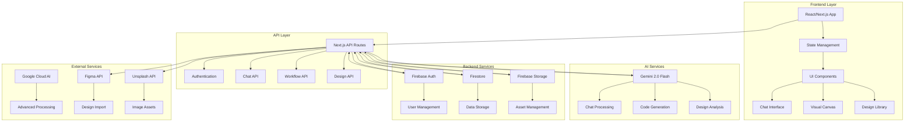
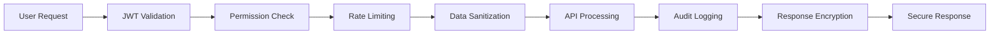

# 🔄 مخطط تدفق البيانات - FlowCanvasAI

## نظرة عامة على بنية البيانات



## 1. تدفق البيانات الأساسي

### 1.1 تدفق المصادقة
```
User Input → Frontend Validation → Firebase Auth → JWT Token → Session Management → UI Update
```

### 1.2 تدفق المحادثة الذكية
```
User Message → Input Validation → Chat API → Gemini AI → Response Processing → Real-time Update → UI Render
```

### 1.3 تدفق منشئ العمليات المرئي
```
User Action → Canvas State → Workflow API → Validation → Firestore → Real-time Sync → Canvas Update
```

## 2. تفصيل تدفق البيانات حسب المكون

### 2.1 واجهة المحادثة (Chat Interface)

#### تدفق إرسال الرسالة:
```typescript
// Frontend → API → AI → Database → Frontend
{
  "flow": "message_send",
  "steps": [
    {
      "step": 1,
      "component": "ChatInput",
      "action": "user_types_message",
      "data": {
        "message": "string",
        "type": "text|voice|image",
        "timestamp": "ISO_8601"
      }
    },
    {
      "step": 2,
      "component": "ChatAPI",
      "action": "validate_and_process",
      "endpoint": "/api/ai/chat",
      "method": "POST"
    },
    {
      "step": 3,
      "component": "GeminiAI",
      "action": "generate_response",
      "processing_time": "~2-5s"
    },
    {
      "step": 4,
      "component": "Firestore",
      "action": "store_conversation",
      "collection": "conversations"
    },
    {
      "step": 5,
      "component": "Frontend",
      "action": "real_time_update",
      "mechanism": "websockets|polling"
    }
  ]
}
```

#### تدفق استقبال الرسالة:
```typescript
{
  "flow": "message_receive",
  "real_time": true,
  "steps": [
    "Firestore Listener → State Update → UI Re-render → Animation Trigger"
  ]
}
```

### 2.2 منشئ العمليات المرئي (Visual Workflow)

#### تدفق إضافة عقدة جديدة:
```typescript
{
  "flow": "node_creation",
  "steps": [
    {
      "step": 1,
      "action": "drag_from_sidebar",
      "data": {
        "nodeType": "trigger|action|condition",
        "position": {"x": number, "y": number}
      }
    },
    {
      "step": 2,
      "action": "collision_detection",
      "algorithm": "grid_snap_with_collision_avoidance"
    },
    {
      "step": 3,
      "action": "state_update",
      "target": "canvas_state"
    },
    {
      "step": 4,
      "action": "api_sync",
      "endpoint": "/api/workflow/nodes",
      "method": "POST"
    },
    {
      "step": 5,
      "action": "database_store",
      "collection": "workflows",
      "document": "user_workflow_id"
    }
  ]
}
```

### 2.3 مكتبة التصميم (Design Library)

#### تدفق تحديث المكون:
```typescript
{
  "flow": "component_update",
  "steps": [
    "User Modification → Validation → Preview Generation → Version Control → Database Update → UI Refresh"
  ]
}
```

## 3. تدفق البيانات في الوقت الفعلي

### 3.1 WebSocket Connections
```typescript
interface RealtimeDataFlow {
  connection: {
    type: "websocket" | "server_sent_events",
    endpoint: "/api/realtime",
    authentication: "JWT_token"
  },
  events: {
    "chat_message": "real_time_message_sync",
    "workflow_update": "canvas_state_sync", 
    "user_presence": "online_status_sync",
    "collaboration": "multi_user_editing"
  }
}
```

### 3.2 State Synchronization
```typescript
// Global State Flow
Frontend State → API Validation → Database Update → Real-time Broadcast → All Connected Clients
```

## 4. تدفق معالجة الأخطاء

### 4.1 Error Handling Pipeline
```typescript
{
  "error_flow": [
    {
      "level": "frontend",
      "actions": ["input_validation", "user_feedback", "retry_mechanism"]
    },
    {
      "level": "api", 
      "actions": ["request_validation", "error_logging", "graceful_degradation"]
    },
    {
      "level": "database",
      "actions": ["transaction_rollback", "data_consistency", "backup_recovery"]
    },
    {
      "level": "ai_service",
      "actions": ["fallback_responses", "rate_limiting", "service_health_check"]
    }
  ]
}
```

## 5. تدفق الأمان والمصادقة

### 5.1 Security Data Flow


### 5.2 Authentication Flow
```typescript
{
  "auth_flow": {
    "login": "Credentials → Firebase Auth → JWT Token → Session Creation → User State",
    "refresh": "Expired Token → Refresh Token → New JWT → Session Update",
    "logout": "User Action → Token Revocation → Session Cleanup → Redirect"
  }
}
```

## 6. تدفق الأداء والتحسين

### 6.1 Performance Optimization Flow
```typescript
{
  "optimization_layers": [
    {
      "layer": "frontend",
      "techniques": ["lazy_loading", "code_splitting", "memoization", "virtual_scrolling"]
    },
    {
      "layer": "api",
      "techniques": ["response_caching", "request_batching", "compression", "cdn"]
    },
    {
      "layer": "database", 
      "techniques": ["query_optimization", "indexing", "connection_pooling", "read_replicas"]
    },
    {
      "layer": "ai_services",
      "techniques": ["response_caching", "prompt_optimization", "batch_processing"]
    }
  ]
}
```

## 7. مراقبة تدفق البيانات

### 7.1 Monitoring Points
```typescript
interface MonitoringFlow {
  metrics: {
    "frontend": ["page_load_time", "user_interactions", "error_rate"],
    "api": ["response_time", "throughput", "error_rate", "resource_usage"], 
    "database": ["query_time", "connection_count", "storage_usage"],
    "ai_services": ["processing_time", "token_usage", "success_rate"]
  },
  alerts: {
    "performance_degradation": "response_time > 2s",
    "error_spike": "error_rate > 5%",
    "resource_exhaustion": "cpu_usage > 80%"
  }
}
```

## 8. تدفق النسخ الاحتياطي والاسترداد

### 8.1 Backup Data Flow
```
Scheduled Backup → Data Export → Compression → Cloud Storage → Verification → Cleanup
```

### 8.2 Recovery Flow  
```
Incident Detection → Backup Selection → Data Restoration → Integrity Check → Service Restart → Validation
```

## 9. التحسينات المستقبلية

### 9.1 Planned Optimizations
- **Edge Caching**: تحسين أوقات الاستجابة
- **GraphQL Integration**: تحسين كفاءة البيانات  
- **Microservices Architecture**: تحسين القابلية للتوسع
- **AI Model Optimization**: تحسين معالجة الذكاء الاصطناعي

### 9.2 Scalability Considerations
```typescript
{
  "horizontal_scaling": {
    "api_servers": "load_balancer → multiple_instances",
    "database": "sharding + read_replicas", 
    "ai_services": "model_serving_with_auto_scaling"
  },
  "vertical_scaling": {
    "resource_optimization": "cpu + memory + storage",
    "performance_tuning": "query_optimization + caching"
  }
}
```

---

## الخلاصة

تم تصميم تدفق البيانات في FlowCanvasAI ليكون:
- **قابل للتوسع**: يدعم النمو المستقبلي
- **آمن**: حماية شاملة للبيانات
- **سريع**: استجابة فورية للمستخدمين
- **موثوق**: معالجة أخطاء شاملة
- **قابل للمراقبة**: رصد شامل للأداء

هذا المخطط يوفر الأساس لفهم كيفية تدفق البيانات عبر النظام بالكامل ويساعد في التطوير والصيانة المستقبلية.