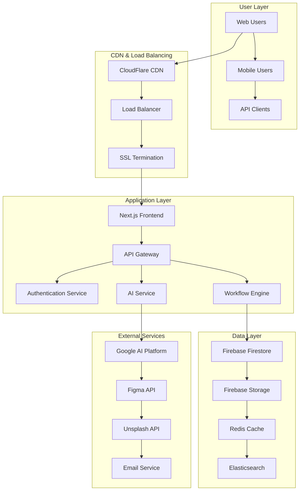

# 🚀 خطة النشر والتشغيل (DevOps) - FlowCanvasAI

## فهرس المحتويات
1. [نظرة عامة على البنية التحتية](#نظرة-عامة)
2. [البيئات والتكوين](#البيئات-والتكوين)
3. [CI/CD Pipeline](#cicd-pipeline)
4. [Container Strategy](#container-strategy)
5. [خطة النشر](#خطة-النشر)
6. [المراقبة والتشخيص](#المراقبة-والتشخيص)
7. [النسخ الاحتياطي والاسترداد](#النسخ-الاحتياطي)
8. [الأمان والحماية](#الأمان-والحماية)
9. [التوسع والأداء](#التوسع-والأداء)
10. [إدارة الحوادث](#إدارة-الحوادث)

---

## نظرة عامة على البنية التحتية

### Cloud Architecture


### Technology Stack

#### Frontend
```yaml
Framework: Next.js 15 (App Router)
Language: TypeScript
Styling: Tailwind CSS v4
State Management: React Context + Custom Hooks
Build Tool: Turbopack
Package Manager: npm/yarn
```

#### Backend
```yaml
Runtime: Node.js 20 LTS
Framework: Next.js API Routes
Database: Firebase Firestore
Authentication: Firebase Auth
Storage: Firebase Storage
Cache: Redis
Search: Elasticsearch (optional)
```

#### AI & ML
```yaml
Primary: Google Gemini 2.0 Flash
Platform: Google AI Platform
Fallback: OpenAI GPT-4 (optional)
```

#### Infrastructure
```yaml
Cloud Provider: Google Cloud Platform
Container: Docker + Kubernetes
CDN: CloudFlare
Monitoring: DataDog / New Relic
Logging: Google Cloud Logging
```

---

## البيئات والتكوين

### Environment Structure
```yaml
environments:
  development:
    url: "https://dev.flowcanvasai.com"
    database: "flowcanvas-dev"
    resources: "minimal"
    
  staging:
    url: "https://staging.flowcanvasai.com"  
    database: "flowcanvas-staging"
    resources: "medium"
    
  production:
    url: "https://flowcanvasai.com"
    database: "flowcanvas-prod"
    resources: "high_availability"
```

### Configuration Management
```typescript
// config/environment.ts
interface EnvironmentConfig {
  NODE_ENV: 'development' | 'staging' | 'production';
  API_BASE_URL: string;
  FIREBASE_CONFIG: {
    apiKey: string;
    authDomain: string;
    projectId: string;
    storageBucket: string;
  };
  GEMINI_API_KEY: string;
  REDIS_URL: string;
  DATABASE_URL: string;
  MONITORING: {
    DATADOG_API_KEY: string;
    NEW_RELIC_LICENSE_KEY: string;
  };
  SECURITY: {
    JWT_SECRET: string;
    ENCRYPTION_KEY: string;
    CORS_ORIGINS: string[];
  };
}
```

### Environment Variables
```bash
# .env.production
NODE_ENV=production
NEXT_PUBLIC_API_URL=https://flowcanvasai.com/api
NEXT_PUBLIC_FIREBASE_API_KEY=xxx
NEXT_PUBLIC_FIREBASE_AUTH_DOMAIN=flowcanvas-prod.firebaseapp.com
NEXT_PUBLIC_FIREBASE_PROJECT_ID=flowcanvas-prod

# Private variables
FIREBASE_ADMIN_KEY=xxx
GEMINI_API_KEY=xxx
REDIS_URL=redis://xxx
JWT_SECRET=xxx
ENCRYPTION_KEY=xxx

# Monitoring
DATADOG_API_KEY=xxx
NEW_RELIC_LICENSE_KEY=xxx

# External APIs
FIGMA_API_TOKEN=xxx
UNSPLASH_ACCESS_KEY=xxx
SENDGRID_API_KEY=xxx
```

---

## CI/CD Pipeline

### GitHub Actions Workflow
```yaml
# .github/workflows/deploy.yml
name: Deploy FlowCanvasAI

on:
  push:
    branches: [main, develop]
  pull_request:
    branches: [main]

env:
  NODE_VERSION: '20'
  DOCKER_REGISTRY: gcr.io
  PROJECT_ID: flowcanvas-prod

jobs:
  test:
    runs-on: ubuntu-latest
    steps:
      - name: Checkout
        uses: actions/checkout@v4
        
      - name: Setup Node.js
        uses: actions/setup-node@v4
        with:
          node-version: ${{ env.NODE_VERSION }}
          cache: 'npm'
          
      - name: Install dependencies
        run: npm ci
        
      - name: Run linting
        run: npm run lint
        
      - name: Run type checking
        run: npm run type-check
        
      - name: Run unit tests
        run: npm run test
        
      - name: Run integration tests
        run: npm run test:integration
        
      - name: Build application
        run: npm run build

  security-scan:
    runs-on: ubuntu-latest
    steps:
      - name: Checkout
        uses: actions/checkout@v4
        
      - name: Run security audit
        run: npm audit --audit-level=moderate
        
      - name: Scan for vulnerabilities
        uses: securecodewarrior/github-action-add-sarif@v1
        with:
          sarif-file: 'security-scan.sarif'

  build-and-push:
    needs: [test, security-scan]
    runs-on: ubuntu-latest
    if: github.ref == 'refs/heads/main'
    
    steps:
      - name: Checkout
        uses: actions/checkout@v4
        
      - name: Setup Docker Buildx
        uses: docker/setup-buildx-action@v3
        
      - name: Login to GCR
        uses: docker/login-action@v3
        with:
          registry: ${{ env.DOCKER_REGISTRY }}
          username: _json_key
          password: ${{ secrets.GCP_SA_KEY }}
          
      - name: Build and push
        uses: docker/build-push-action@v5
        with:
          context: .
          push: true
          tags: |
            ${{ env.DOCKER_REGISTRY }}/${{ env.PROJECT_ID }}/flowcanvasai:latest
            ${{ env.DOCKER_REGISTRY }}/${{ env.PROJECT_ID }}/flowcanvasai:${{ github.sha }}
          cache-from: type=gha
          cache-to: type=gha,mode=max

  deploy-staging:
    needs: build-and-push
    runs-on: ubuntu-latest
    if: github.ref == 'refs/heads/develop'
    
    steps:
      - name: Deploy to Staging
        run: |
          # Deploy to Kubernetes staging environment
          kubectl set image deployment/flowcanvasai-staging \
            app=${{ env.DOCKER_REGISTRY }}/${{ env.PROJECT_ID }}/flowcanvasai:${{ github.sha }}

  deploy-production:
    needs: build-and-push
    runs-on: ubuntu-latest
    if: github.ref == 'refs/heads/main'
    environment: production
    
    steps:
      - name: Deploy to Production
        run: |
          # Deploy to Kubernetes production environment
          kubectl set image deployment/flowcanvasai-prod \
            app=${{ env.DOCKER_REGISTRY }}/${{ env.PROJECT_ID }}/flowcanvasai:${{ github.sha }}
          
      - name: Run smoke tests
        run: npm run test:smoke
        
      - name: Notify deployment
        uses: 8398a7/action-slack@v3
        with:
          status: ${{ job.status }}
          channel: '#deployments'
          webhook_url: ${{ secrets.SLACK_WEBHOOK }}
```

### Deployment Scripts
```bash
#!/bin/bash
# scripts/deploy.sh

set -e

ENVIRONMENT=${1:-staging}
IMAGE_TAG=${2:-latest}

echo "🚀 Deploying FlowCanvasAI to $ENVIRONMENT..."

# Validate environment
if [[ ! "$ENVIRONMENT" =~ ^(staging|production)$ ]]; then
    echo "❌ Invalid environment. Use 'staging' or 'production'"
    exit 1
fi

# Set environment-specific variables
if [ "$ENVIRONMENT" = "production" ]; then
    NAMESPACE="flowcanvas-prod"
    REPLICAS=3
    RESOURCES_REQUESTS_CPU="500m"
    RESOURCES_REQUESTS_MEMORY="1Gi"
    RESOURCES_LIMITS_CPU="2"
    RESOURCES_LIMITS_MEMORY="4Gi"
else
    NAMESPACE="flowcanvas-staging"
    REPLICAS=2
    RESOURCES_REQUESTS_CPU="250m"
    RESOURCES_REQUESTS_MEMORY="512Mi"
    RESOURCES_LIMITS_CPU="1"
    RESOURCES_LIMITS_MEMORY="2Gi"
fi

# Update Kubernetes deployment
envsubst < k8s/deployment.yaml | kubectl apply -f -

# Wait for rollout to complete
kubectl rollout status deployment/flowcanvasai -n $NAMESPACE --timeout=600s

# Run health checks
echo "🔍 Running health checks..."
kubectl exec -n $NAMESPACE deployment/flowcanvasai -- curl -f http://localhost:3000/api/health

echo "✅ Deployment completed successfully!"

# Send notification
curl -X POST $SLACK_WEBHOOK_URL \
  -H 'Content-Type: application/json' \
  -d "{
    \"text\": \"✅ FlowCanvasAI deployed to $ENVIRONMENT successfully!\",
    \"channel\": \"#deployments\"
  }"
```

---

## Container Strategy

### Dockerfile
```dockerfile
# Dockerfile
FROM node:20-alpine AS base

# Install dependencies only when needed
FROM base AS deps
WORKDIR /app

# Install dependencies based on the preferred package manager
COPY package.json package-lock.json* ./
RUN npm ci --only=production && npm cache clean --force

# Rebuild the source code only when needed
FROM base AS builder
WORKDIR /app
COPY --from=deps /app/node_modules ./node_modules
COPY . .

# Build the application
ENV NEXT_TELEMETRY_DISABLED 1
RUN npm run build

# Production image, copy all the files and run next
FROM base AS runner
WORKDIR /app

ENV NODE_ENV production
ENV NEXT_TELEMETRY_DISABLED 1

RUN addgroup --system --gid 1001 nodejs
RUN adduser --system --uid 1001 nextjs

# Copy built application
COPY --from=builder /app/public ./public
COPY --from=builder --chown=nextjs:nodejs /app/.next/standalone ./
COPY --from=builder --chown=nextjs:nodejs /app/.next/static ./.next/static

# Health check
HEALTHCHECK --interval=30s --timeout=3s --start-period=5s --retries=3 \
  CMD curl -f http://localhost:3000/api/health || exit 1

USER nextjs

EXPOSE 3000
ENV PORT 3000
ENV HOSTNAME "0.0.0.0"

CMD ["node", "server.js"]
```

### Kubernetes Manifests

#### Deployment
```yaml
# k8s/deployment.yaml
apiVersion: apps/v1
kind: Deployment
metadata:
  name: flowcanvasai
  namespace: ${NAMESPACE}
  labels:
    app: flowcanvasai
    version: ${IMAGE_TAG}
spec:
  replicas: ${REPLICAS}
  strategy:
    type: RollingUpdate
    rollingUpdate:
      maxUnavailable: 1
      maxSurge: 1
  selector:
    matchLabels:
      app: flowcanvasai
  template:
    metadata:
      labels:
        app: flowcanvasai
        version: ${IMAGE_TAG}
      annotations:
        prometheus.io/scrape: "true"
        prometheus.io/port: "3000"
        prometheus.io/path: "/api/metrics"
    spec:
      containers:
      - name: app
        image: gcr.io/${PROJECT_ID}/flowcanvasai:${IMAGE_TAG}
        ports:
        - containerPort: 3000
          name: http
        env:
        - name: NODE_ENV
          value: ${ENVIRONMENT}
        - name: REDIS_URL
          valueFrom:
            secretKeyRef:
              name: flowcanvas-secrets
              key: redis-url
        - name: FIREBASE_ADMIN_KEY
          valueFrom:
            secretKeyRef:
              name: flowcanvas-secrets
              key: firebase-admin-key
        resources:
          requests:
            cpu: ${RESOURCES_REQUESTS_CPU}
            memory: ${RESOURCES_REQUESTS_MEMORY}
          limits:
            cpu: ${RESOURCES_LIMITS_CPU}
            memory: ${RESOURCES_LIMITS_MEMORY}
        livenessProbe:
          httpGet:
            path: /api/health
            port: 3000
          initialDelaySeconds: 30
          periodSeconds: 10
          timeoutSeconds: 5
          failureThreshold: 3
        readinessProbe:
          httpGet:
            path: /api/health
            port: 3000
          initialDelaySeconds: 5
          periodSeconds: 5
          timeoutSeconds: 3
          failureThreshold: 3
        startupProbe:
          httpGet:
            path: /api/health
            port: 3000
          initialDelaySeconds: 10
          periodSeconds: 10
          timeoutSeconds: 5
          failureThreshold: 30
      imagePullSecrets:
      - name: gcr-json-key
```

#### Service
```yaml
# k8s/service.yaml
apiVersion: v1
kind: Service
metadata:
  name: flowcanvasai-service
  namespace: ${NAMESPACE}
  labels:
    app: flowcanvasai
spec:
  type: ClusterIP
  ports:
  - port: 80
    targetPort: 3000
    protocol: TCP
    name: http
  selector:
    app: flowcanvasai
```

#### Ingress
```yaml
# k8s/ingress.yaml
apiVersion: networking.k8s.io/v1
kind: Ingress
metadata:
  name: flowcanvasai-ingress
  namespace: ${NAMESPACE}
  annotations:
    kubernetes.io/ingress.class: "nginx"
    cert-manager.io/cluster-issuer: "letsencrypt-prod"
    nginx.ingress.kubernetes.io/ssl-redirect: "true"
    nginx.ingress.kubernetes.io/force-ssl-redirect: "true"
    nginx.ingress.kubernetes.io/rate-limit: "100"
    nginx.ingress.kubernetes.io/rate-limit-window: "1m"
spec:
  tls:
  - hosts:
    - ${DOMAIN}
    secretName: flowcanvas-tls
  rules:
  - host: ${DOMAIN}
    http:
      paths:
      - path: /
        pathType: Prefix
        backend:
          service:
            name: flowcanvasai-service
            port:
              number: 80
```

#### HorizontalPodAutoscaler
```yaml
# k8s/hpa.yaml
apiVersion: autoscaling/v2
kind: HorizontalPodAutoscaler
metadata:
  name: flowcanvasai-hpa
  namespace: ${NAMESPACE}
spec:
  scaleTargetRef:
    apiVersion: apps/v1
    kind: Deployment
    name: flowcanvasai
  minReplicas: ${MIN_REPLICAS}
  maxReplicas: ${MAX_REPLICAS}
  metrics:
  - type: Resource
    resource:
      name: cpu
      target:
        type: Utilization
        averageUtilization: 70
  - type: Resource
    resource:
      name: memory
      target:
        type: Utilization
        averageUtilization: 80
  behavior:
    scaleDown:
      stabilizationWindowSeconds: 300
      policies:
      - type: Percent
        value: 50
        periodSeconds: 60
    scaleUp:
      stabilizationWindowSeconds: 30
      policies:
      - type: Percent
        value: 100
        periodSeconds: 15
```

---

## خطة النشر

### Deployment Phases

#### Phase 1: Pre-deployment
```bash
#!/bin/bash
# 1. Code Review and Testing
echo "🔍 Running pre-deployment checks..."

# Run all tests
npm run test:all

# Security scan
npm audit --audit-level=moderate

# Performance tests
npm run test:performance

# Database migrations (if any)
npm run db:migrate

# Build and validate
npm run build
npm run validate:build
```

#### Phase 2: Blue-Green Deployment
```bash
#!/bin/bash
# 2. Blue-Green Deployment Strategy

# Deploy to green environment
kubectl apply -f k8s/deployment-green.yaml

# Wait for green environment to be ready
kubectl wait --for=condition=available deployment/flowcanvasai-green --timeout=600s

# Run smoke tests on green environment
npm run test:smoke --env=green

# Switch traffic to green environment
kubectl patch service flowcanvasai-service -p '{"spec":{"selector":{"version":"green"}}}'

# Monitor for 5 minutes
sleep 300

# If successful, remove blue environment
kubectl delete deployment flowcanvasai-blue
```

#### Phase 3: Post-deployment
```bash
#!/bin/bash
# 3. Post-deployment validation

# Health checks
curl -f https://flowcanvasai.com/api/health

# Performance monitoring
npm run monitor:performance

# Error rate monitoring
npm run monitor:errors

# User experience validation
npm run test:e2e:critical-path

# Send success notification
npm run notify:deployment-success
```

### Rollback Strategy
```bash
#!/bin/bash
# Automated rollback procedure

echo "🔄 Initiating rollback..."

# Get previous deployment
PREVIOUS_DEPLOYMENT=$(kubectl rollout history deployment/flowcanvasai -n production | tail -2 | head -1 | awk '{print $1}')

# Rollback to previous version
kubectl rollout undo deployment/flowcanvasai -n production --to-revision=$PREVIOUS_DEPLOYMENT

# Wait for rollback to complete
kubectl rollout status deployment/flowcanvasai -n production --timeout=300s

# Verify rollback
curl -f https://flowcanvasai.com/api/health

# Notify team
curl -X POST $SLACK_WEBHOOK_URL \
  -H 'Content-Type: application/json' \
  -d '{"text": "⚠️ FlowCanvasAI rollback completed"}'
```

---

## المراقبة والتشخيص

### Monitoring Stack
```yaml
monitoring:
  metrics:
    - Prometheus + Grafana
    - DataDog (Primary)
    - New Relic (Backup)
    
  logging:
    - Google Cloud Logging
    - ELK Stack (Optional)
    
  tracing:
    - Jaeger
    - DataDog APM
    
  alerts:
    - PagerDuty
    - Slack
    - Email
```

### Key Metrics to Monitor

#### Application Metrics
```typescript
interface ApplicationMetrics {
  performance: {
    response_time: "p50, p95, p99";
    throughput: "requests_per_second";
    error_rate: "errors_per_minute";
    availability: "uptime_percentage";
  };
  
  business: {
    user_registrations: "daily_active_users";
    ai_interactions: "ai_calls_per_hour";
    workflow_executions: "workflows_run_per_day";
    revenue_metrics: "subscription_revenue";
  };
  
  infrastructure: {
    cpu_usage: "average_cpu_percentage";
    memory_usage: "average_memory_percentage";
    disk_usage: "disk_space_percentage";
    network: "bandwidth_utilization";
  };
  
  security: {
    failed_logins: "failed_login_attempts";
    api_abuse: "rate_limit_violations";
    security_events: "suspicious_activities";
  };
}
```

#### Alert Rules
```yaml
# alerts.yaml
groups:
- name: flowcanvasai-alerts
  rules:
  - alert: HighErrorRate
    expr: rate(http_requests_total{status=~"5.."}[5m]) > 0.05
    for: 5m
    labels:
      severity: critical
    annotations:
      summary: "High error rate detected"
      description: "Error rate is {{ $value }} for the last 5 minutes"
      
  - alert: HighResponseTime
    expr: histogram_quantile(0.95, rate(http_request_duration_seconds_bucket[5m])) > 2
    for: 10m
    labels:
      severity: warning
    annotations:
      summary: "High response time detected"
      
  - alert: DatabaseConnectionPool
    expr: database_connections_active / database_connections_max > 0.8
    for: 5m
    labels:
      severity: warning
    annotations:
      summary: "Database connection pool nearly exhausted"
      
  - alert: AIServiceDown
    expr: up{job="ai-service"} == 0
    for: 2m
    labels:
      severity: critical
    annotations:
      summary: "AI service is down"
```

### Grafana Dashboards
```json
{
  "dashboard": {
    "title": "FlowCanvasAI - Production Overview",
    "panels": [
      {
        "title": "Request Rate",
        "type": "graph",
        "targets": [
          {
            "expr": "rate(http_requests_total[5m])",
            "legendFormat": "{{method}} {{status}}"
          }
        ]
      },
      {
        "title": "Response Time Distribution",
        "type": "heatmap",
        "targets": [
          {
            "expr": "rate(http_request_duration_seconds_bucket[5m])",
            "format": "heatmap"
          }
        ]
      },
      {
        "title": "AI Service Performance",
        "type": "stat",
        "targets": [
          {
            "expr": "rate(ai_requests_total[5m])",
            "legendFormat": "AI Requests/sec"
          }
        ]
      },
      {
        "title": "Database Performance",
        "type": "graph",
        "targets": [
          {
            "expr": "firebase_operations_duration_seconds",
            "legendFormat": "{{operation}}"
          }
        ]
      }
    ]
  }
}
```

---

## النسخ الاحتياطي والاسترداد

### Backup Strategy
```yaml
backup_strategy:
  firebase_firestore:
    frequency: "daily"
    retention: "30_days"
    method: "automated_export"
    location: "gs://flowcanvas-backups"
    
  firebase_storage:
    frequency: "daily"
    retention: "90_days"
    method: "gsutil_sync"
    
  application_code:
    frequency: "on_every_commit"
    location: "github_repository"
    branches: ["main", "develop"]
    
  configuration:
    frequency: "on_change"
    method: "gitops"
    location: "private_config_repo"
```

### Backup Scripts
```bash
#!/bin/bash
# scripts/backup.sh

DATE=$(date +%Y%m%d_%H%M%S)
BACKUP_BUCKET="gs://flowcanvas-backups"

echo "🔄 Starting backup process..."

# 1. Firestore backup
echo "📄 Backing up Firestore..."
gcloud firestore export $BACKUP_BUCKET/firestore/$DATE \
  --project=flowcanvas-prod \
  --async

# 2. Storage backup
echo "📁 Backing up Storage..."
gsutil -m rsync -r -d gs://flowcanvas-prod.appspot.com \
  $BACKUP_BUCKET/storage/$DATE

# 3. Configuration backup
echo "⚙️ Backing up configuration..."
kubectl get configmaps,secrets -n production -o yaml > \
  /tmp/k8s-config-$DATE.yaml
gsutil cp /tmp/k8s-config-$DATE.yaml \
  $BACKUP_BUCKET/config/

# 4. Database schema backup (if using SQL)
echo "🗄️ Backing up database schema..."
# pg_dump or similar commands here

# 5. Cleanup old backups
echo "🧹 Cleaning up old backups..."
gsutil -m rm -r $(gsutil ls $BACKUP_BUCKET/firestore/ | head -n -7)

echo "✅ Backup completed successfully!"

# Send notification
curl -X POST $SLACK_WEBHOOK_URL \
  -H 'Content-Type: application/json' \
  -d "{\"text\": \"✅ Daily backup completed for FlowCanvasAI\"}"
```

### Disaster Recovery Plan
```bash
#!/bin/bash
# scripts/disaster-recovery.sh

echo "🚨 Initiating disaster recovery..."

RECOVERY_POINT=${1:-latest}
RECOVERY_BUCKET="gs://flowcanvas-backups"

# 1. Restore Firestore
echo "📄 Restoring Firestore from backup..."
gcloud firestore import $RECOVERY_BUCKET/firestore/$RECOVERY_POINT \
  --project=flowcanvas-prod

# 2. Restore Storage
echo "📁 Restoring Storage from backup..."
gsutil -m rsync -r -d $RECOVERY_BUCKET/storage/$RECOVERY_POINT \
  gs://flowcanvas-prod.appspot.com

# 3. Restore application
echo "🚀 Deploying last known good version..."
kubectl apply -f k8s/deployment-recovery.yaml

# 4. Restore configuration
echo "⚙️ Restoring configuration..."
kubectl apply -f $RECOVERY_BUCKET/config/k8s-config-$RECOVERY_POINT.yaml

# 5. Verify recovery
echo "🔍 Verifying recovery..."
sleep 60
curl -f https://flowcanvasai.com/api/health

# 6. Notify team
curl -X POST $SLACK_WEBHOOK_URL \
  -H 'Content-Type: application/json' \
  -d "{\"text\": \"🚨 Disaster recovery completed for FlowCanvasAI\"}"

echo "✅ Disaster recovery completed!"
```

### Recovery Testing
```bash
#!/bin/bash
# scripts/test-recovery.sh

echo "🧪 Testing disaster recovery procedures..."

# Create test environment
kubectl create namespace recovery-test

# Restore to test environment
./scripts/disaster-recovery.sh latest --namespace=recovery-test

# Run validation tests
npm run test:recovery-validation --env=recovery-test

# Cleanup test environment
kubectl delete namespace recovery-test

echo "✅ Recovery testing completed!"
```

---

## الأمان والحماية

### Security Checklist
```yaml
security_measures:
  authentication:
    - Multi-factor authentication (MFA)
    - JWT token security
    - Session management
    - Password policies
    
  authorization:
    - Role-based access control (RBAC)
    - API rate limiting
    - Resource-level permissions
    - Audit logging
    
  infrastructure:
    - Network security groups
    - VPC isolation
    - SSL/TLS encryption
    - Container security scanning
    
  application:
    - Input validation
    - Output encoding
    - SQL injection prevention
    - CSRF protection
    
  monitoring:
    - Security event logging
    - Intrusion detection
    - Vulnerability scanning
    - Compliance monitoring
```

### Security Scanning
```bash
#!/bin/bash
# scripts/security-scan.sh

echo "🔒 Running security scans..."

# 1. Dependency vulnerability scan
echo "📦 Scanning dependencies..."
npm audit --audit-level=moderate
snyk test

# 2. Container security scan
echo "🐳 Scanning container..."
docker run --rm -v /var/run/docker.sock:/var/run/docker.sock \
  aquasec/trivy image gcr.io/flowcanvas-prod/flowcanvasai:latest

# 3. Infrastructure security scan
echo "☁️ Scanning infrastructure..."
terraform plan -out=tfplan
terraform show -json tfplan | checkov -f -

# 4. Code security scan
echo "💻 Scanning code..."
semgrep --config=auto .

# 5. API security test
echo "🔌 Testing API security..."
newman run security-tests.postman_collection.json

echo "✅ Security scanning completed!"
```

### Secrets Management
```yaml
# k8s/secrets.yaml
apiVersion: v1
kind: Secret
metadata:
  name: flowcanvas-secrets
  namespace: production
type: Opaque
data:
  # All values are base64 encoded
  firebase-admin-key: <base64_encoded_value>
  gemini-api-key: <base64_encoded_value>
  jwt-secret: <base64_encoded_value>
  redis-url: <base64_encoded_value>
  database-url: <base64_encoded_value>
```

---

## التوسع والأداء

### Auto-scaling Configuration
```yaml
# Horizontal Pod Autoscaler
autoscaling:
  enabled: true
  minReplicas: 3
  maxReplicas: 50
  targetCPUUtilizationPercentage: 70
  targetMemoryUtilizationPercentage: 80
  
# Vertical Pod Autoscaler
vertical_autoscaling:
  enabled: true
  updateMode: "Auto"
  resourcePolicy:
    containerPolicies:
    - containerName: app
      maxAllowed:
        cpu: 4
        memory: 8Gi
      minAllowed:
        cpu: 100m
        memory: 256Mi
```

### Performance Optimization
```typescript
// Performance monitoring configuration
interface PerformanceConfig {
  caching: {
    redis: {
      ttl: 3600; // 1 hour
      maxMemory: "2gb";
      evictionPolicy: "allkeys-lru";
    };
    cdn: {
      cacheTtl: 86400; // 24 hours
      staticAssets: true;
      apiCaching: false;
    };
  };
  
  database: {
    connectionPool: {
      min: 5;
      max: 20;
      acquireTimeoutMillis: 30000;
      idleTimeoutMillis: 600000;
    };
    indexing: {
      autoOptimize: true;
      backgroundReindex: true;
    };
  };
  
  apiLimits: {
    rateLimiting: {
      windowMs: 60000; // 1 minute
      max: 1000; // requests per window
    };
    payload: {
      maxSize: "10mb";
      timeout: 30000; // 30 seconds
    };
  };
}
```

### Load Testing
```bash
#!/bin/bash
# scripts/load-test.sh

echo "🏋️ Running load tests..."

# Install k6 if not present
if ! command -v k6 &> /dev/null; then
    echo "Installing k6..."
    # Installation commands here
fi

# Run load tests
k6 run --vus 100 --duration 10m load-tests/api-test.js
k6 run --vus 50 --duration 5m load-tests/frontend-test.js
k6 run --vus 25 --duration 15m load-tests/ai-service-test.js

# Generate report
k6 report --out json=load-test-results.json

echo "✅ Load testing completed!"
```

```javascript
// load-tests/api-test.js
import http from 'k6/http';
import { check } from 'k6';

export let options = {
  stages: [
    { duration: '2m', target: 20 },   // Ramp up
    { duration: '5m', target: 100 },  // Stay at 100 users
    { duration: '2m', target: 200 },  // Ramp up to 200 users
    { duration: '5m', target: 200 },  // Stay at 200 users
    { duration: '2m', target: 0 },    // Ramp down
  ],
  thresholds: {
    http_req_duration: ['p(95)<2000'], // 95% of requests under 2s
    http_req_failed: ['rate<0.05'],    // Error rate under 5%
  },
};

export default function() {
  let response = http.post('https://flowcanvasai.com/api/ai/chat', {
    message: 'Test message',
    type: 'text'
  }, {
    headers: {
      'Content-Type': 'application/json',
      'Authorization': 'Bearer test-token'
    }
  });
  
  check(response, {
    'status is 200': (r) => r.status === 200,
    'response time < 2000ms': (r) => r.timings.duration < 2000,
  });
}
```

---

## إدارة الحوادث

### Incident Response Plan
```yaml
incident_response:
  severity_levels:
    P1: # Critical - Service completely down
      response_time: "15 minutes"
      resolution_target: "4 hours"
      escalation: ["CTO", "Lead Engineer", "DevOps Lead"]
      
    P2: # High - Major feature impaired
      response_time: "1 hour"
      resolution_target: "24 hours"
      escalation: ["Lead Engineer", "DevOps Lead"]
      
    P3: # Medium - Minor feature impaired
      response_time: "4 hours"
      resolution_target: "72 hours"
      escalation: ["On-call Engineer"]
      
    P4: # Low - Documentation/cosmetic issues
      response_time: "24 hours"
      resolution_target: "1 week"
      escalation: ["Development Team"]
```

### Incident Response Scripts
```bash
#!/bin/bash
# scripts/incident-response.sh

SEVERITY=${1:-P3}
DESCRIPTION=${2:-"Incident detected"}

echo "🚨 Initiating incident response - Severity: $SEVERITY"

# 1. Create incident ticket
INCIDENT_ID=$(curl -X POST $INCIDENT_MANAGEMENT_API \
  -H "Authorization: Bearer $API_TOKEN" \
  -d "{
    \"severity\": \"$SEVERITY\",
    \"description\": \"$DESCRIPTION\",
    \"service\": \"FlowCanvasAI\"
  }" | jq -r '.incident_id')

echo "📋 Incident created: $INCIDENT_ID"

# 2. Notify on-call team
curl -X POST $PAGERDUTY_API \
  -H "Authorization: Token token=$PAGERDUTY_TOKEN" \
  -d "{
    \"incident\": {
      \"type\": \"incident\",
      \"title\": \"FlowCanvasAI - $DESCRIPTION\",
      \"service\": {\"id\": \"$SERVICE_ID\", \"type\": \"service_reference\"},
      \"urgency\": \"high\",
      \"body\": {\"type\": \"incident_body\", \"details\": \"$DESCRIPTION\"}
    }
  }"

# 3. Start war room if P1/P2
if [[ "$SEVERITY" =~ ^(P1|P2)$ ]]; then
    echo "🏠 Creating war room..."
    curl -X POST $SLACK_API \
      -H "Authorization: Bearer $SLACK_TOKEN" \
      -d "{
        \"name\": \"incident-$INCIDENT_ID\",
        \"purpose\": \"War room for incident $INCIDENT_ID\"
      }"
fi

# 4. Gather initial diagnostics
echo "🔍 Gathering diagnostics..."
kubectl get pods -n production --show-labels
kubectl top nodes
kubectl top pods -n production

# 5. Create incident timeline
echo "⏰ Creating incident timeline..."
echo "$(date): Incident $INCIDENT_ID created - $DESCRIPTION" >> incidents/$INCIDENT_ID-timeline.md

echo "✅ Incident response initiated!"
```

### Post-Incident Review
```markdown
# Post-Incident Review Template

## Incident Summary
- **Incident ID**: INC-XXXX
- **Date**: YYYY-MM-DD
- **Duration**: X hours Y minutes
- **Severity**: PX
- **Impact**: Description of user impact

## Timeline
- **HH:MM** - Issue first detected
- **HH:MM** - Investigation started
- **HH:MM** - Root cause identified
- **HH:MM** - Fix deployed
- **HH:MM** - Service restored

## Root Cause Analysis
### What Happened?
- Detailed explanation of the incident

### Root Cause
- Technical root cause
- Contributing factors

### Detection
- How was the issue detected?
- Was monitoring effective?

## Resolution
### Immediate Actions
- What was done to resolve the issue?

### Verification
- How was the fix verified?

## Prevention
### Action Items
- [ ] Item 1 - Owner - Due Date
- [ ] Item 2 - Owner - Due Date

### Process Improvements
- Monitoring enhancements
- Alerting improvements
- Documentation updates

## Lessons Learned
- What went well?
- What could be improved?
- Follow-up actions
```

---

## الخلاصة والمراحل التالية

### Current DevOps Maturity
```yaml
maturity_assessment:
  current_state:
    automation: "70%"
    monitoring: "80%"
    security: "75%"
    recovery: "65%"
    
  target_state:
    automation: "90%"
    monitoring: "95%"
    security: "90%"
    recovery: "85%"
```

### Roadmap (Next 6 Months)
```yaml
roadmap:
  month_1_2:
    - Complete monitoring setup
    - Implement automated testing
    - Set up disaster recovery
    
  month_3_4:
    - Advanced security scanning
    - Performance optimization
    - Multi-region deployment
    
  month_5_6:
    - Chaos engineering
    - Advanced observability
    - Self-healing systems
```

### Success Metrics
```typescript
interface SuccessMetrics {
  reliability: {
    uptime: "99.9%";
    mttr: "<30 minutes";
    deploymentSuccess: "95%";
  };
  
  performance: {
    deploymentTime: "<10 minutes";
    responseTime: "<500ms p95";
    errorRate: "<0.1%";
  };
  
  security: {
    vulnerabilityRemediation: "<24 hours";
    securityIncidents: "0 per month";
    complianceScore: "95%";
  };
}
```

---

هذه الخطة توفر إطار عمل شامل لنشر وتشغيل منصة FlowCanvasAI بشكل احترافي وموثوق، مع التركيز على الأمان والأداء والاستقرار.