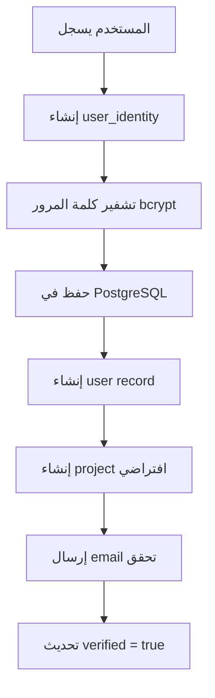

# 🗄️ هيكل قاعدة البيانات - Activepieces

## 📍 أين تُخزن معلومات التسجيل؟

---

## 🎯 **الإجابة المباشرة:**

```
📦 PostgreSQL Database: activepieces
  └─ 📊 Table: user_identity
      ├─ email ✅
      ├─ password (hashed) 🔐
      ├─ firstName
      ├─ lastName
      ├─ verified
      └─ provider (email/google/github)
  
  └─ 📊 Table: user
      ├─ id (user ID)
      ├─ identityId → user_identity.id
      ├─ platformId
      ├─ platformRole
      └─ status
```

---

## 🔍 **التفاصيل الكاملة:**

### **1. جدول `user_identity` (المعلومات الأساسية)**

```sql
-- هيكل الجدول
CREATE TABLE user_identity (
  id VARCHAR(21) PRIMARY KEY,
  created TIMESTAMP WITH TIME ZONE DEFAULT NOW(),
  updated TIMESTAMP WITH TIME ZONE DEFAULT NOW(),
  email VARCHAR NOT NULL UNIQUE,        -- 📧 البريد الإلكتروني
  password VARCHAR NOT NULL,             -- 🔐 كلمة المرور (hashed)
  trackEvents BOOLEAN,
  newsLetter BOOLEAN,
  verified BOOLEAN NOT NULL DEFAULT FALSE, -- ✅ تم التحقق؟
  firstName VARCHAR NOT NULL,            -- 👤 الاسم الأول
  lastName VARCHAR NOT NULL,             -- 👤 الاسم الأخير
  tokenVersion VARCHAR,                  -- 🎫 إصدار Token
  provider VARCHAR NOT NULL              -- 🔑 الموفر (email/google/github)
);

-- مثال على البيانات المخزنة:
-- id: 'Kj8Hs2mPq1NxR4tLv'
-- email: 'user@example.com'
-- password: '$2b$10$ABC...XYZ' (bcrypt hash)
-- verified: true
-- firstName: 'أحمد'
-- lastName: 'محمد'
-- provider: 'email'
```

### **2. جدول `user` (معلومات المستخدم في النظام)**

```sql
CREATE TABLE "user" (
  id VARCHAR(21) PRIMARY KEY,
  created TIMESTAMP WITH TIME ZONE DEFAULT NOW(),
  updated TIMESTAMP WITH TIME ZONE DEFAULT NOW(),
  status VARCHAR NOT NULL,               -- حالة المستخدم (ACTIVE/INACTIVE)
  externalId VARCHAR,                    -- معرف خارجي (Firebase UID مثلاً)
  platformId VARCHAR,                    -- معرف المنصة
  platformRole VARCHAR NOT NULL,         -- الدور (OWNER/MEMBER/ADMIN)
  identityId VARCHAR NOT NULL,           -- → user_identity.id
  lastChangelogDismissed TIMESTAMP,
  
  FOREIGN KEY (identityId) REFERENCES user_identity(id)
);
```

### **3. الجداول المرتبطة**

```sql
-- Projects (المشاريع)
project
  ├─ id
  ├─ ownerId → user.id
  ├─ displayName
  └─ platformId

-- Flows (التدفقات)
flow
  ├─ id
  ├─ projectId → project.id
  └─ displayName

-- App Connections (الاتصالات)
app_connection
  ├─ id
  ├─ ownerId → user.id
  └─ name
```

---

## 🔐 **كيف يتم تخزين كلمة المرور؟**

### **1. التشفير (Hashing)**

```typescript
// عند التسجيل:
const password = "MySecurePassword123";

// يتم تشفيرها باستخدام bcrypt:
const hashedPassword = await bcrypt.hash(password, 10);
// النتيجة: $2b$10$N9qo8uLOickgx2ZMRZoMyeIjZAgcfl7p92ldGxad68LJZdL17lhWy

// يتم تخزين hash فقط، ليس كلمة المرور الأصلية!
```

### **2. التحقق (Verification)**

```typescript
// عند تسجيل الدخول:
const inputPassword = "MySecurePassword123";
const storedHash = "$2b$10$N9qo8uLO..."; // من قاعدة البيانات

const isValid = await bcrypt.compare(inputPassword, storedHash);
// true إذا كانت كلمة المرور صحيحة
```

---

## 📊 **الهيكل الكامل للبيانات:**

```
عند التسجيل، يتم إنشاء:

1️⃣ user_identity (المعلومات الشخصية)
   ├─ id: 'xyz123abc'
   ├─ email: 'aziz@example.com'
   ├─ password: '$2b$10$...' (hashed)
   ├─ firstName: 'عزيز'
   ├─ lastName: 'سيف'
   └─ verified: false

2️⃣ user (معلومات النظام)
   ├─ id: 'user_abc123'
   ├─ identityId: 'xyz123abc' → user_identity
   ├─ platformRole: 'OWNER'
   └─ status: 'ACTIVE'

3️⃣ project (مشروع افتراضي)
   ├─ id: 'proj_123'
   ├─ ownerId: 'user_abc123' → user
   └─ displayName: 'My Project'

4️⃣ platform (منصة افتراضية)
   ├─ id: 'platform_1'
   ├─ ownerId: 'user_abc123'
   └─ name: 'platform'
```

---

## 🔄 **دورة حياة المستخدم:**



---

## 🔍 **استعراض البيانات الفعلية:**

### **عرض المستخدمين المسجلين:**

```bash
# الاتصال بقاعدة البيانات
docker exec -it activepieces-postgres psql -U postgres -d activepieces

# عرض user_identity
SELECT id, email, firstName, lastName, verified, provider 
FROM user_identity;

# عرض users
SELECT u.id, u.status, u.platformRole, ui.email 
FROM "user" u
JOIN user_identity ui ON u."identityId" = ui.id;

# عرض projects
SELECT p.id, p.displayName, ui.email as owner_email
FROM project p
JOIN "user" u ON p."ownerId" = u.id
JOIN user_identity ui ON u."identityId" = ui.id;
```

---

## 🔐 **الأمان والخصوصية:**

### **✅ ما يتم تخزينه بشكل آمن:**

```
✅ كلمة المرور: مشفرة bcrypt (لا يمكن فك تشفيرها)
✅ البريد الإلكتروني: نص عادي (مطلوب للتواصل)
✅ الاسم: نص عادي
✅ JWT Tokens: لا تُخزن في قاعدة البيانات (فقط tokenVersion)
```

### **⚠️ ما لا يتم تخزينه:**

```
❌ كلمة المرور الأصلية (فقط hash)
❌ JWT Tokens (تُنشأ ديناميكياً)
❌ Session data (في Redis)
```

---

## 🔄 **الربط مع Firebase (الاستراتيجية):**

### **Option 1: تخزين Firebase UID**

```sql
-- في جدول user
UPDATE "user" 
SET "externalId" = 'firebase_uid_xyz123'
WHERE email = 'aziz@example.com';

-- الآن يمكنك الربط:
-- Firebase UID ←→ Activepieces User
```

### **Option 2: استخدام email كمعرف مشترك**

```typescript
// عند تسجيل دخول Firebase:
const firebaseUser = auth.currentUser;
const email = firebaseUser.email;

// جلب user من Activepieces:
const apUser = await getActivepiecesUserByEmail(email);

// إذا لم يكن موجوداً، أنشئه:
if (!apUser) {
  await createActivepiecesUser({
    email,
    password: generateRandomPassword(), // لن يستخدم
    externalId: firebaseUser.uid
  });
}
```

### **Option 3: API Keys بدلاً من Passwords**

```typescript
// المستخدم لا يسجل دخول في Activepieces أبداً
// فقط Firebase → API Key

const apiKey = await generateActivepiecesApiKey(userId);
// استخدام API Key لكل requests

fetch('http://localhost:8080/api/v1/flows', {
  headers: {
    'Authorization': `Bearer ${apiKey}`
  }
});
```

---

## 📍 **موقع الملفات الفعلي:**

```
🐳 Docker Container: activepieces-postgres
  └─ 📦 PostgreSQL Data: /var/lib/postgresql/data
      └─ 🗄️ Database: activepieces
          ├─ user_identity (51 جدول إجمالي)
          ├─ user
          ├─ project
          ├─ flow
          └─ ...

💾 على جهازك:
  └─ Docker Volume: nexus_postgres_data
      └─ المسار: C:\Users\[USER]\AppData\Local\Docker\wsl\data\ext4.vhdx
          (داخل WSL2)
```

---

## 🔧 **إدارة قاعدة البيانات:**

### **Backup:**

```bash
# عمل نسخة احتياطية
docker exec activepieces-postgres pg_dump \
  -U postgres activepieces > backup.sql

# استعادة
docker exec -i activepieces-postgres psql \
  -U postgres activepieces < backup.sql
```

### **حذف كل البيانات:**

```bash
# حذف المستخدمين (احذر!)
docker exec activepieces-postgres psql \
  -U postgres -d activepieces \
  -c "DELETE FROM \"user\"; DELETE FROM user_identity;"
```

### **عرض عدد المستخدمين:**

```bash
docker exec activepieces-postgres psql \
  -U postgres -d activepieces \
  -c "SELECT COUNT(*) FROM user_identity;"
```

---

## 🎯 **الخلاصة:**

```
❓ أين تُخزن معلومات التسجيل؟
✅ PostgreSQL → Database: activepieces
   └─ Table: user_identity
       ├─ email
       ├─ password (bcrypt hash)
       ├─ firstName, lastName
       └─ verified

❓ هل يمكن الوصول إليها؟
✅ نعم، عبر SQL queries
✅ أو عبر Activepieces API
✅ محمية بـ authentication

❓ هل يمكن استبدالها بـ Firebase?
✅ نعم، باستخدام externalId
✅ أو API Keys بدلاً من passwords
✅ راجع: ACTIVEPIECES-FIREBASE-AUTH.md
```

---

## 🔗 **الأوامر السريعة:**

```bash
# الاتصال بقاعدة البيانات
docker exec -it activepieces-postgres psql -U postgres -d activepieces

# عرض جميع الجداول
\dt

# عرض هيكل جدول معين
\d user_identity

# عرض المستخدمين
SELECT email, firstName, verified FROM user_identity;

# الخروج
\q
```

---

**الآن أنت تعرف بالضبط أين وكيف يتم تخزين معلومات التسجيل!** 🎯
