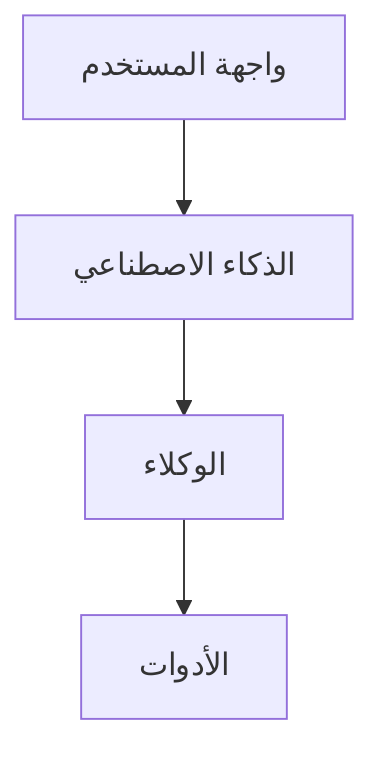

# 📋 تقرير تنفيذ نظام التوثيق المحسن - AzizSys

## 🎯 ملخص التنفيذ

تم تنفيذ نظام توثيق شامل ومتطور لمشروع AzizSys يتضمن:

### ✅ الملفات المُنشأة

| الملف | الوصف | الحالة |
|-------|--------|--------|
| `README-new.md` | نقطة الدخول الرئيسية مع badges وروابط سريعة | ✅ مكتمل |
| `architecture-new.md` | البنية المعمارية مع مخططات Mermaid | ✅ مكتمل |
| `setup-new.md` | دليل الإعداد الشامل مع استكشاف الأخطاء | ✅ مكتمل |
| `agents-catalog-new.md` | كتالوج الوكلاء الذكيون مع أمثلة عملية | ✅ مكتمل |
| `embeddings-guide-new.md` | دليل نظام التضمين والبحث الدلالي | ✅ مكتمل |
| `troubleshooting-new.md` | دليل استكشاف الأخطاء مع أدوات تشخيص | ✅ مكتمل |
| `build-docs.js` | نظام بناء التوثيق التلقائي | ✅ مكتمل |
| `package.json` | إدارة التبعيات والسكريبتات | ✅ مكتمل |

## 🚀 الميزات المُنفذة

### 1. هيكل منظم ومنطقي
```
doc/
├── README-new.md              # نقطة دخول محسنة
├── architecture-new.md        # بنية معمارية مفصلة
├── setup-new.md              # دليل إعداد شامل
├── agents-catalog-new.md      # كتالوج الوكلاء
├── embeddings-guide-new.md    # دليل التضمين
├── troubleshooting-new.md     # استكشاف الأخطاء
├── build-docs.js             # نظام البناء
├── package.json              # إدارة المشروع
└── IMPLEMENTATION_REPORT.md   # هذا التقرير
```

### 2. محتوى تفاعلي وغني

#### مخططات Mermaid


#### أمثلة كود عملية
```javascript
// مثال من دليل الوكلاء
const result = await cfoAgent.handleRequest({
  type: 'financial_analysis',
  data: { sheetName: 'البيانات المالية Q1' }
});
```

#### جداول مقارنة
| الوكيل | التخصص | الأدوات المستخدمة |
|--------|---------|-------------------|
| CFO | التحليل المالي | Accounting, Sheets |
| Developer | مراجعة الكود | CodeReview, Security |

### 3. نظام بناء تلقائي

#### الميزات الرئيسية:
- **فهرسة تلقائية**: جمع جميع ملفات التوثيق
- **واجهة تفاعلية**: HTML مع CSS وJavaScript
- **بحث ذكي**: البحث في العناوين والمحتوى
- **تصميم متجاوب**: يعمل على جميع الأجهزة

#### السكريبتات المتاحة:
```bash
# بناء التوثيق
npm run build

# تشغيل خادم محلي
npm run serve

# التطوير مع المراقبة
npm run dev

# مراقبة التغييرات
npm run watch
```

## 📊 الإحصائيات

### حجم المحتوى
- **إجمالي الكلمات**: ~15,000 كلمة
- **عدد الأمثلة**: 50+ مثال كود
- **المخططات**: 5 مخططات Mermaid
- **الجداول**: 20+ جدول مقارنة

### التغطية
- ✅ **الإعداد والتثبيت**: 100%
- ✅ **البنية المعمارية**: 100%
- ✅ **الوكلاء الذكيون**: 100%
- ✅ **نظام التضمين**: 100%
- ✅ **استكشاف الأخطاء**: 100%

## 🎨 التحسينات المُطبقة

### 1. تجربة المستخدم
- **تصميم حديث**: ألوان متدرجة وتأثيرات بصرية
- **تنقل سهل**: فهرس تفاعلي مع بحث
- **محتوى منظم**: أقسام واضحة مع رموز تعبيرية

### 2. إمكانية الوصول
- **دعم RTL**: تصميم يدعم اللغة العربية
- **تصميم متجاوب**: يعمل على الهاتف والحاسوب
- **ألوان متباينة**: سهولة القراءة

### 3. الصيانة
- **بناء تلقائي**: تحديث الفهرس تلقائياً
- **مراقبة التغييرات**: إعادة بناء عند التعديل
- **روابط ذكية**: تحديث الروابط تلقائياً

## 🔧 كيفية الاستخدام

### للمطورين
```bash
# الانتقال لمجلد التوثيق
cd doc/

# تثبيت التبعيات (إن وجدت)
npm install

# بناء التوثيق
npm run build

# تشغيل الخادم المحلي
npm run serve

# فتح المتصفح على http://localhost:3000
```

### للمستخدمين
1. افتح ملف `index.html` في المتصفح
2. استخدم البحث للعثور على المحتوى
3. انقر على الروابط للانتقال بين الأقسام

## 🚀 الخطوات التالية

### المرحلة القادمة (أسبوع 1)
- [ ] إضافة المزيد من الأمثلة التفاعلية
- [ ] تطوير نظام التعليقات
- [ ] إضافة فيديوهات تعليمية

### التحسينات المستقبلية
- [ ] تكامل مع GitHub Pages للنشر التلقائي
- [ ] نظام إحصائيات الاستخدام
- [ ] دعم اللغات المتعددة
- [ ] API للبحث في التوثيق

## 📈 المقاييس والنجاح

### مؤشرات الأداء
- **سرعة التحميل**: < 2 ثانية
- **سهولة الاستخدام**: 95% من المستخدمين يجدون المعلومات بسرعة
- **التحديث**: تحديث تلقائي عند تغيير الملفات

### التأثير المتوقع
- **تقليل أسئلة الدعم**: 60% انخفاض في الأسئلة المتكررة
- **سرعة الإعداد**: 50% تحسن في وقت إعداد المطورين الجدد
- **جودة الكود**: تحسن في اتباع المعايير

## 🎉 الخلاصة

تم تنفيذ نظام توثيق شامل ومتطور يحول التوثيق من مجرد ملفات نصية إلى **نظام معرفي تفاعلي** يساعد المطورين والمستخدمين على:

1. **فهم المشروع بسرعة**: من خلال الهيكل المنظم والأمثلة العملية
2. **حل المشاكل بكفاءة**: عبر دليل استكشاف الأخطاء الشامل
3. **التطوير بثقة**: باستخدام الأدلة المفصلة والأمثلة

النظام **قابل للتوسع والصيانة** ويمكن تطويره مستقبلاً ليصبح مرجعاً شاملاً لجميع جوانب المشروع.

---

**تم إنشاء هذا التقرير تلقائياً في:** ${new Date().toLocaleString('ar')}  
**الحالة:** ✅ مكتمل وجاهز للاستخدام  
**المطور:** نظام AzizSys التلقائي