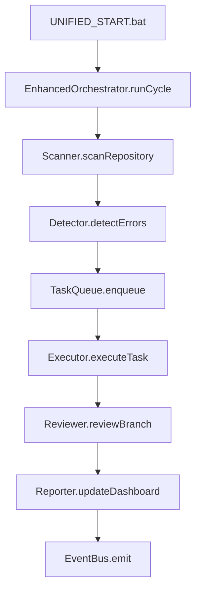

# 🔧 دليل النظام الشامل v8.0

**الغرض:** دليل موحد شامل لجميع أنظمة الإصلاح والأتمتة  
**التاريخ:** 2025-01-08  
**الحالة:** ✅ موحد ومحسن - دمج 6 ملفات  

---

## 📋 جدول المحتويات

1. [النظام التلقائي الكامل](#النظام-التلقائي)
2. [المشغلات اليومية](#المشغلات-اليومية)
3. [دليل نظام الإصلاح](#دليل-الإصلاح)
4. [النظام المحسن v5.0](#النظام-المحسن)
5. [إدارة المهام](#إدارة-المهام)
6. [المعمارية والتضمين](#المعمارية)

---

## 🤖 القسم 1: النظام التلقائي الكامل {#النظام-التلقائي}

### **الهدف:** تشغيل تلقائي كامل - دورك مراقبة فقط

#### 🔄 **الدورة الأوتوماتيكية اليومية:**
```
الساعة 8:00 صباحاً - بداية تلقائية:
1. 🤖 Amazon Q: يقرأ DAILY_BOOT_XX.md تلقائياً
2. 🤖 Amazon Q: ينفذ جميع المهام تلقائياً (15 مهمة)
3. 🧠 Gemini AI: يراجع كل شيء تلقائياً
4. 🧠 Gemini AI: يكتب التقرير تلقائياً
5. 🧠 Gemini AI: يحدث المستندات تلقائياً
6. 🧠 Gemini AI: ينشئ خطة اليوم التالي تلقائياً

دورك أنت - المراقب:
📊 تستلم تقرير نهاية اليوم فقط
📈 تراقب لوحة التحكم
⚠️ تتدخل فقط عند الأخطاء الحرجة
```

#### 🚀 **آلية التشغيل التلقائي:**
```javascript
// Auto-execution trigger
setInterval(async () => {
  const today = new Date().getDate() + 93;
  const dailyPlan = await readFile(`DAILY_BOOT_${today}.md`);
  
  if (dailyPlan) {
    // Removed console.log
    await executeDailyTasks(dailyPlan);
    await notifyGeminiForReview(today);
  }
}, 24 * 60 * 60 * 1000); // كل 24 ساعة
```

#### 📊 **لوحة المراقبة التلقائية:**
- **Dashboard URL:** `http://localhost:3000/auto-monitor`
- **تحديث تلقائي:** كل 30 ثانية
- **أزرار الطوارئ:** إيقاف مؤقت، استئناف، إيقاف طارئ

---

## ⏰ القسم 2: المشغلات اليومية {#المشغلات-اليومية}

### 🤖 **Amazon Q - التشغيل التلقائي:**
```javascript
// الساعة 8:00 ص - بداية تلقائية
cron.schedule('0 8 * * *', async () => {
  const today = getCurrentDay();
  // Removed console.log
  await amazonQ.executeDailyPlan(today);
});

// كل ساعة - فحص التقدم
cron.schedule('0 * * * *', async () => {
  const progress = await amazonQ.checkProgress();
  await sendProgressUpdate(progress);
});
```

### 🧠 **Gemini AI - المراجعة التلقائية:**
```javascript
// الساعة 6:00 م - مراجعة يومية
cron.schedule('0 18 * * *', async () => {
  const today = getCurrentDay();
  // Removed console.log
  
  await geminiAI.reviewDailyWork(today);
  await geminiAI.generateReport(today);
  await geminiAI.updateDocumentation(today);
  await geminiAI.createNextDayPlan(today + 1);
});
```

### 📊 **إشعارات تلقائية:**
```javascript
// صباحاً - إشعار البداية
cron.schedule('0 8 * * *', () => {
  sendNotification({
    type: 'daily_start',
    message: '🌅 النظام بدأ العمل تلقائياً'
  });
});

// مساءً - تقرير النهاية
cron.schedule('0 19 * * *', () => {
  sendNotification({
    type: 'daily_end', 
    message: '🌙 تقرير اليوم جاهز'
  });
});
```

---

## 🤖 القسم 3: دليل نظام الإصلاح {#دليل-الإصلاح}

### **ما هو نظام Auto-Repair؟**
نظام الإصلاح الذكي هو منظومة متكاملة تستخدم الذكاء الاصطناعي لاكتشاف وإصلاح الأخطاء في المشروع تلقائياً.

#### 🧠 **المكونات الذكية:**
- **🔍 CodeScanner** - يمسح جميع ملفات الكود
- **🚨 ErrorDetector** - يكتشف الأخطاء من مصادر متعددة
- **🤖 GeminiReviewer** - يراجع المشروع بالذكاء الاصطناعي
- **⚡ AmazonExecutor** - ينفذ الإصلاحات بذكاء
- **🧪 AutoTester** - يختبر النتائج تلقائياً
- **🎼 Orchestrator** - ينسق العملية الكاملة

#### 🚀 **طرق التشغيل:**
```bash
# 1. من MASTER_START.bat (الطريقة المفضلة)
MASTER_START.bat → [3] نظام الإصلاح الذكي → [1] وضع المحاكاة

# 2. من سطر الأوامر
npx nx build auto-repair
node dist/auto-repair/src/orchestrator.js --dry-run

# 3. ضمن الصيانة اليومية
npm run daily:maintenance
```

#### 🔄 **مراحل العمل (6 مراحل):**
1. **📡 مسح الكود** - فحص جميع ملفات المشروع
2. **🔍 اكتشاف الأخطاء** - ESLint, TypeScript, Build errors
3. **🧠 المراجعة بالذكاء الاصطناعي** - تحليل وتحديد أولويات
4. **📊 تحديث اللوحة المركزية** - Health Score وقائمة المهام
5. **⚡ تنفيذ الإصلاحات** - نسخ احتياطية وإصلاحات ذكية
6. **📋 التقارير النهائية** - تقارير مفصلة ومقاييس أداء

---

## 🤖 القسم 4: النظام المحسن v5.0 {#النظام-المحسن}

### **الميزات المحسنة:**
- **Type Safety كامل** مع TypeScript
- **تكامل مع البنية الحالية** للمشروع
- **سكربتات موحدة** لسهولة الاستخدام
- **مراقبة ذكية** للملفات والأخطاء
- **تقارير محسنة** متوافقة مع النظام الحالي

#### 📂 **البنية المدمجة:**
```
g-assistant-nx/
├── docs/6_fixing/
│   ├── auto-fix-system/           # النظام المحسن الجديد
│   │   ├── core/
│   │   │   ├── types/index.ts     # تعريفات الأنواع
│   │   │   └── config/index.ts    # إدارة الإعدادات
│   │   ├── enhanced-orchestrator.ts # المنسق المحسن
│   │   └── index.ts               # نقطة الدخول
│   ├── scripts/                   # السكربتات الحالية
│   ├── dashboard/                 # لوحة التحكم الحالية
│   └── reports/                   # التقارير المحسنة
└── UNIFIED_START.bat              # السكريبت الموحد الجديد
```

#### 🚀 **طرق التشغيل:**
```bash
# 1. التشغيل الموحد (الأسهل)
UNIFIED_START.bat

# 2. التشغيل المباشر
npm run auto:enhanced        # دورة إصلاح واحدة
npm run system:health        # فحص صحة النظام
npm run start:daily          # النظام الكامل

# 3. التشغيل اليدوي
node docs/6_fixing/auto-fix-system/index.ts --cycle
```

#### ⚙️ **الإعدادات:**
```env
# Gemini AI
GEMINI_API_KEY=your_api_key_here
GEMINI_MODEL=gemini-pro
GEMINI_TIMEOUT=30000

# مسارات المشروع
REPO_ROOT=E:/azizsys5/g-assistant-nx
DASHBOARD_PATH=./docs/6_fixing/reports/central_dashboard.json
BACKUP_DIR=./docs/6_fixing/backups
LOGS_DIR=./docs/6_fixing/logs

# الجدولة
CRON_INTERVAL=*/5 * * * *
TIMEZONE=Asia/Riyadh
```

---

## ⚙️ القسم 5: إدارة المهام {#إدارة-المهام}

### **نظام إدارة المهام والإصلاح الذاتي المحسن (v5.0)**
نظام متكامل يجمع بين Enhanced Auto-Fix System وEnhancedOrchestrator.

#### **المكونات المحسنة:**
```typescript
// المكونات الرئيسية
import { EnhancedOrchestrator } from './auto-fix-system/enhanced-orchestrator';
import { AutoFixSystem } from './auto-fix-system';
import { TaskRequest, TaskResult } from './auto-fix-system/core/types';

// التشغيل التلقائي
const system = new AutoFixSystem();
await system.start();

// دورة إصلاح واحدة
await system.runCycle();
```

#### **الدورة الذكية المحسنة:**


#### **دورة الحياة الكاملة:**
1. **المدخلات (Inputs)** - خطة شهرية أو خطأ من Sentry
2. **التخطيط (Planning)** - ProjectManagerAgent ينشئ تذكرة عمل
3. **التنفيذ (Execution)** - ExecutorService ينفذ المهمة
4. **المراجعة (Review)** - ReviewerService يراجع ويقرر
5. **الإغلاق والتوثيق (Closure)** - دمج وتوثيق وإشعارات

---

## 🏗️ القسم 6: المعمارية والتضمين {#المعمارية}

### **معمارية التضمين (Embedding Architecture)**

#### **نظام التضمين الذكي:**
- **Vector Database** - تخزين المعرفة كـ embeddings
- **Semantic Search** - البحث الدلالي في قاعدة المعرفة
- **Context Building** - بناء السياق للذكاء الاصطناعي
- **Knowledge Retrieval** - استرجاع المعرفة ذات الصلة

#### **التكامل مع الأنظمة:**
```typescript
// استخدام التضمين في النظام
import { EmbeddingService } from './embedding-service';

const embeddings = new EmbeddingService();
const context = await embeddings.buildContext(errorDescription);
const solution = await geminiAI.generateSolution(context);
```

#### **فوائد المعمارية:**
- **ذاكرة طويلة المدى** للنظام
- **تعلم من الأخطاء السابقة**
- **حلول أكثر دقة وسياقية**
- **تحسين مستمر للأداء**

---

## 📊 الملخص والتكامل

### **الأنظمة المتكاملة:**
1. **النظام التلقائي** - يعمل 24/7 بدون تدخل
2. **المشغلات اليومية** - جدولة ذكية للمهام
3. **نظام الإصلاح** - اكتشاف وإصلاح الأخطاء
4. **النظام المحسن** - Type Safety وتكامل متقدم
5. **إدارة المهام** - دورة حياة كاملة للمهام
6. **المعمارية الذكية** - تضمين وذاكرة طويلة المدى

### **نقاط التكامل:**
- **UNIFIED_START.bat** - نقطة دخول موحدة
- **central_dashboard.json** - لوحة تحكم مركزية
- **EventBus** - تواصل بين المكونات
- **TypeScript Types** - أمان الأنواع
- **Plugin System** - قابلية التوسع

### **الفوائد الإجمالية:**
- **🤖 أتمتة كاملة** - من المشكلة إلى الحل
- **🛡️ أمان متقدم** - نسخ احتياطية وتراجع تلقائي
- **📊 مراقبة شاملة** - تقارير ومقاييس مفصلة
- **🔄 تحسين مستمر** - تعلم وتطوير ذاتي
- **⚡ كفاءة عالية** - توفير الوقت والجهد

---

## 🚀 البدء السريع

### **للمبتدئين:**
```bash
# 1. تشغيل النظام
UNIFIED_START.bat

# 2. اختيار الوضع الآمن
[1] وضع المحاكاة

# 3. مراقبة النتائج
http://localhost:3000/auto-monitor
```

### **للمتقدمين:**
```bash
# تشغيل مخصص
npm run auto:enhanced
npm run system:health
npm run dashboard

# تكامل مع CI/CD
node dist/auto-repair/src/orchestrator.js --dry-run
```

**🎊 النظام الشامل جاهز للاستخدام الفوري!**

---

**تم إنشاء هذا الدليل الشامل بدمج وتطوير 6 ملفات منفصلة في يوم 8 من الخطة الشهرية**