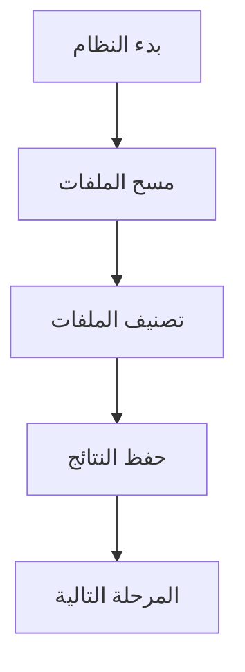
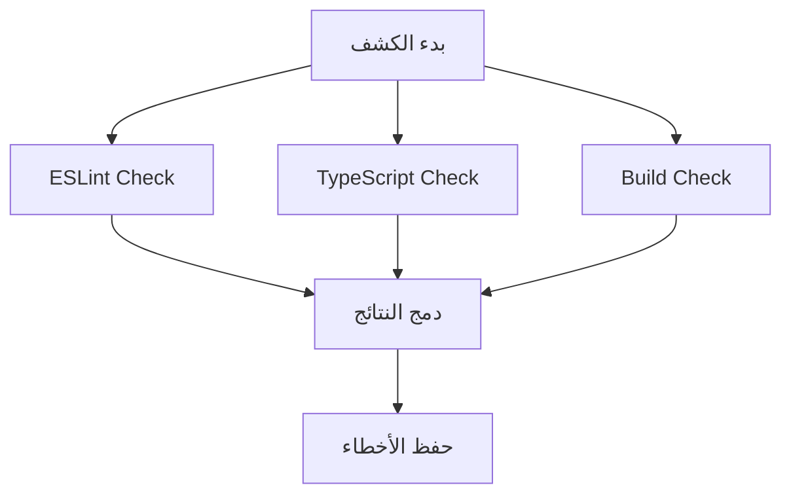
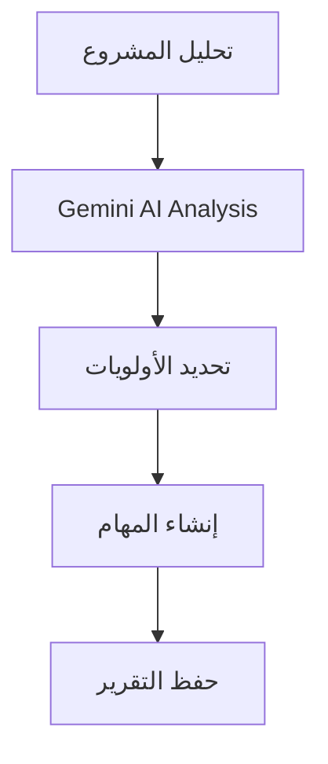

# 🔧 المواصفات التقنية لنظام Auto-Repair

**الإصدار:** 2.0  
**التاريخ:** 2025-01-11  
**المطور:** Smart Executor v5.0  

---

## 🏗️ البنية التقنية

### 📦 **المكونات الأساسية:**

#### 1. **Orchestrator (المنسق الرئيسي)**
```typescript
class AutoRepairOrchestrator {
  // ينسق العملية الكاملة من 6 مراحل
  async run(): Promise<void>
  private updateCentralDashboard(): Promise<void>
  private executeReviewerTasks(): Promise<void>
  private generateFinalReport(): Promise<void>
}
```

#### 2. **CodeScanner (ماسح الكود)**
```typescript
class CodeScanner {
  // يمسح ملفات المشروع ويصنفها
  async scanSpecificPaths(paths: string[]): Promise<CodeFile[]>
  async saveResults(files: CodeFile[], path: string): Promise<void>
}
```

#### 3. **ErrorDetector (كاشف الأخطاء)**
```typescript
class ErrorDetector {
  // يكتشف الأخطاء من مصادر متعددة
  async detectAllErrors(): Promise<DetectedError[]>
  private detectESLintErrors(): Promise<DetectedError[]>
  private detectTypeScriptErrors(): Promise<DetectedError[]>
  private detectBuildErrors(): Promise<DetectedError[]>
}
```

#### 4. **GeminiReviewer (مراجع الذكاء الاصطناعي)**
```typescript
class GeminiReviewer {
  // يراجع المشروع بالذكاء الاصطناعي
  async reviewProject(): Promise<ReviewResult>
  async saveReviewReport(review: ReviewResult): Promise<void>
  private analyzeCodeQuality(): Promise<QualityMetrics>
}
```

#### 5. **AmazonExecutor (منفذ الإصلاحات)**
```typescript
class AmazonExecutor {
  // ينفذ الإصلاحات بذكاء وأمان
  async executeTask(task: TaskRequest): Promise<boolean>
  private createBackup(filePath: string): Promise<string>
  private updateFile(task: TaskRequest): Promise<boolean>
  private testChanges(task: TaskRequest): Promise<boolean>
}
```

---

## 🔄 تدفق العمليات (Workflow)

### 📊 **المرحلة 1: المسح والتحليل**


### 🔍 **المرحلة 2: اكتشاف الأخطاء**


### 🧠 **المرحلة 3: المراجعة الذكية**


---

## 📁 هيكل البيانات

### 🗂️ **DetectedError Interface:**
```typescript
interface DetectedError {
  id: string;                    // معرف فريد
  file: string;                  // مسار الملف
  line: number;                  // رقم السطر
  column: number;                // رقم العمود
  severity: 'error' | 'warning' | 'info';
  message: string;               // رسالة الخطأ
  rule?: string;                 // القاعدة المخالفة
  source: 'eslint' | 'typescript' | 'build' | 'GeminiReviewer';
  context: string;               // سياق الخطأ
  suggestedFix?: string;         // الإصلاح المقترح
}
```

### 📋 **TaskRequest Interface:**
```typescript
interface TaskRequest {
  taskId: string;                // معرف المهمة
  source: string;                // مصدر المهمة
  priority: 'HIGH' | 'MEDIUM' | 'LOW';
  action: 'FIX' | 'UPDATE' | 'DELETE';
  location: string;              // موقع الملف
  details: string;               // تفاصيل المهمة
  estimatedTime: string;         // الوقت المتوقع
}
```

### 📊 **ReviewResult Interface:**
```typescript
interface ReviewResult {
  projectHealth: 'HEALTHY' | 'WARNING' | 'CRITICAL';
  healthScore: number;           // 0-100
  priorities: TaskRequest[];     // المهام ذات الأولوية
  recommendations: string[];     // التوصيات
  metrics: {
    totalFiles: number;
    totalErrors: number;
    codeQuality: number;
    securityScore: number;
  };
}
```

---

## 🛡️ آليات الأمان

### 💾 **نظام النسخ الاحتياطية:**
```typescript
class BackupManager {
  // إنشاء نسخة احتياطية قبل كل تعديل
  async createBackup(filePath: string): Promise<string> {
    const timestamp = Date.now();
    const backupName = `${path.basename(filePath)}.backup.${timestamp}`;
    const backupPath = path.join(this.backupsDir, backupName);
    
    fs.copyFileSync(fullPath, backupPath);
    return backupPath;
  }
  
  // استعادة من النسخة الاحتياطية
  async restoreBackup(filePath: string): Promise<void> {
    const latestBackup = this.findLatestBackup(filePath);
    if (latestBackup) {
      fs.copyFileSync(latestBackup, filePath);
    }
  }
}
```

### 🧪 **نظام الاختبار التلقائي:**
```typescript
class AutoTester {
  // اختبار التغييرات قبل التطبيق
  async testChanges(task: TaskRequest): Promise<boolean> {
    try {
      const project = this.getProjectFromPath(task.location);
      
      if (project) {
        // اختبار المشروع المحدد
        execSync(`nx test ${project}`, { stdio: 'pipe' });
        execSync(`nx lint ${project}`, { stdio: 'pipe' });
      }
      
      return true;
    } catch (error) {
      // استعادة النسخة الاحتياطية عند الفشل
      await this.restoreBackup(task.location);
      return false;
    }
  }
}
```

---

## 📊 نظام التقارير

### 📈 **Central Dashboard:**
```json
{
  "lastUpdate": "2025-01-11T03:00:00Z",
  "project": "g-assistant-nx",
  "status": "HEALTHY",
  "autoRepair": {
    "lastRun": "2025-01-11T03:00:00Z",
    "filesScanned": 150,
    "errorsDetected": 25,
    "errorsFixed": 20,
    "tasksFromReview": 5,
    "status": "COMPLETED"
  },
  "metrics": {
    "healthScore": 85,
    "totalFiles": 150,
    "totalErrors": 5,
    "lastHealthCheck": "2025-01-11T03:00:00Z"
  }
}
```

### 📋 **Final Report Structure:**
```json
{
  "timestamp": "2025-01-11T03:00:00Z",
  "project": "g-assistant-nx",
  "summary": {
    "totalFiles": 150,
    "totalErrors": 25,
    "tasksExecuted": 20,
    "healthScore": 85,
    "status": "HEALTHY"
  },
  "breakdown": {
    "fileTypes": {
      "typescript": 80,
      "javascript": 30,
      "json": 25,
      "markdown": 15
    },
    "errorSeverity": {
      "error": 5,
      "warning": 15,
      "info": 5
    },
    "errorSources": {
      "eslint": 10,
      "typescript": 8,
      "build": 2,
      "GeminiReviewer": 5
    }
  },
  "recommendations": [
    "إصلاح 5 أخطاء حرجة فوراً",
    "مراجعة 15 تحذير لتحسين جودة الكود",
    "تشغيل ESLint --fix للإصلاحات التلقائية"
  ]
}
```

---

## ⚙️ إعدادات التكوين

### 🔧 **ملف التكوين الرئيسي:**
```typescript
// config/auto-repair.config.ts
export const AutoRepairConfig = {
  // إعدادات المسارات
  paths: {
    projectRoot: path.resolve(__dirname, '../../'),
    reportsDir: 'docs/6_fixing/reports',
    backupsDir: '.backups',
    logsDir: 'docs/6_fixing/logs'
  },
  
  // إعدادات الأمان
  security: {
    createBackups: true,
    testBeforeApply: true,
    requireConfirmation: true,
    maxBackupsPerFile: 10
  },
  
  // إعدادات الأداء
  performance: {
    maxConcurrentTasks: 5,
    timeoutPerTask: 300000, // 5 minutes
    retryAttempts: 3
  },
  
  // إعدادات الذكاء الاصطناعي
  ai: {
    geminiModel: 'gemini-2.0-flash-exp',
    confidenceThreshold: 0.7,
    maxTokens: 4000
  }
};
```

---

## 🔌 نقاط التكامل

### 📡 **تكامل مع MASTER_START.bat:**
```batch
# الخيار [3] في القائمة الرئيسية
:AUTO_REPAIR
echo 🤖 بدء نظام الإصلاح الذكي...
call npx nx build auto-repair
node dist/auto-repair/src/orchestrator.js --dry-run
```

### 🔄 **تكامل مع الصيانة اليومية:**
```bash
# ضمن daily:maintenance
npm run auto-fix:v2  # النسخة المبسطة
```

### 🌐 **تكامل مع CI/CD:**
```yaml
# GitHub Actions
- name: Auto Repair Check
  run: |
    npx nx build auto-repair
    node dist/auto-repair/src/orchestrator.js --dry-run
    
- name: Upload Reports
  uses: actions/upload-artifact@v3
  with:
    name: auto-repair-reports
    path: docs/6_fixing/reports/
```

---

## 📈 مقاييس الأداء

### ⏱️ **أوقات التنفيذ المتوقعة:**
```
📡 مسح الكود: 30-60 ثانية
🔍 اكتشاف الأخطاء: 60-120 ثانية
🧠 المراجعة الذكية: 120-300 ثانية
⚡ تنفيذ الإصلاحات: 60-180 ثانية
📊 إنشاء التقارير: 30-60 ثانية
```

### 💾 **استهلاك الموارد:**
```
💾 الذاكرة: 200-500 MB
💽 مساحة القرص: 50-200 MB (للتقارير والنسخ الاحتياطية)
🔄 المعالج: متوسط 20-40% أثناء التشغيل
```

---

## 🆘 استكشاف الأخطاء التقنية

### ❌ **أخطاء شائعة وحلولها:**

#### 1. **Module Not Found:**
```bash
# المشكلة: مكتبات مفقودة
# الحل:
npm install glob @google/generative-ai
```

#### 2. **Permission Denied:**
```bash
# المشكلة: صلاحيات غير كافية
# الحل: تشغيل كمدير أو تغيير الصلاحيات
```

#### 3. **Build Failed:**
```bash
# المشكلة: أخطاء في TypeScript
# الحل: فحص وإصلاح أخطاء TypeScript أولاً
```

### 🔧 **أدوات التشخيص:**
```typescript
// أداة فحص النظام
class SystemDiagnostics {
  async checkSystemHealth(): Promise<DiagnosticReport> {
    return {
      nodeVersion: process.version,
      memoryUsage: process.memoryUsage(),
      diskSpace: await this.checkDiskSpace(),
      dependencies: await this.checkDependencies(),
      permissions: await this.checkPermissions()
    };
  }
}
```

---

## 🚀 خطط التطوير المستقبلية

### 🔮 **الإصدار 3.0 (مخطط):**
- 🤖 **تكامل أعمق مع الذكاء الاصطناعي**
- 🔄 **إصلاحات تلقائية أكثر ذكاءً**
- 📊 **تحليلات متقدمة للأداء**
- 🌐 **واجهة ويب للمراقبة**
- 📱 **تطبيق جوال للإشعارات**

### 🎯 **تحسينات مقترحة:**
- ⚡ **تحسين السرعة** بنسبة 50%
- 🧠 **دقة أعلى** في اكتشاف الأخطاء
- 🔒 **أمان معزز** مع تشفير النسخ الاحتياطية
- 📊 **تقارير تفاعلية** مع رسوم بيانية

---

**🔧 تم إنشاء هذه المواصفات التقنية بواسطة Smart Executor v5.0**