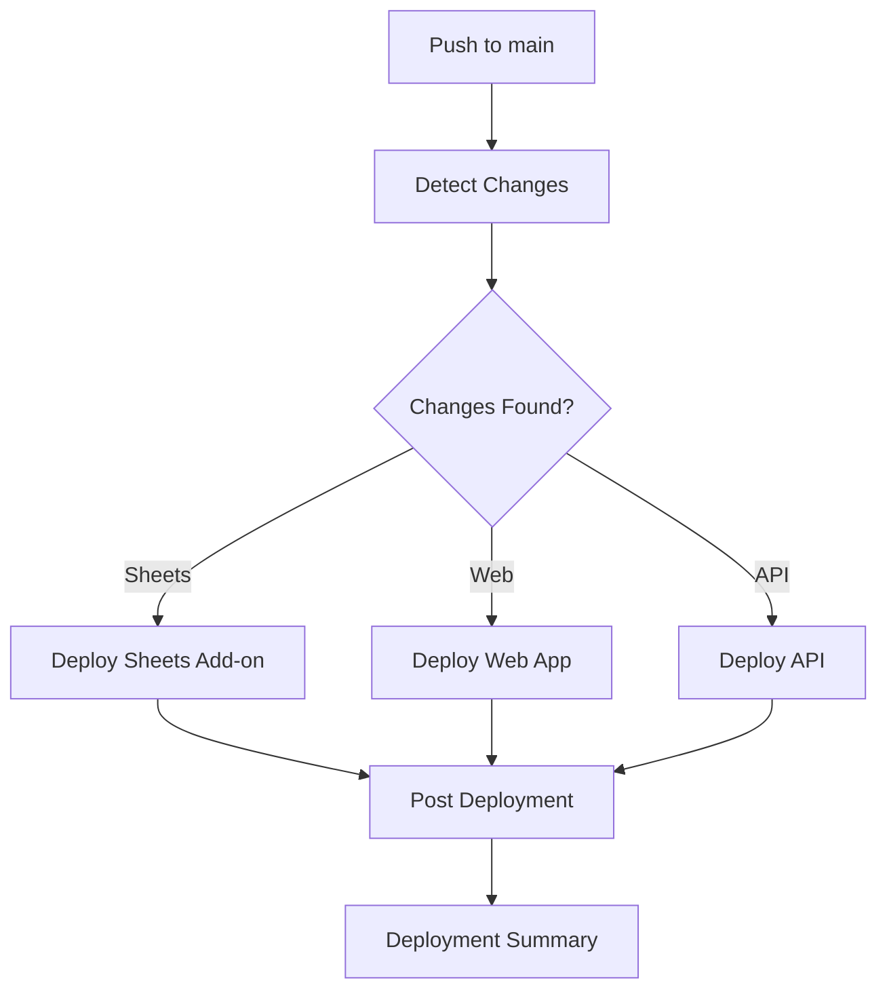

# 🚀 تقرير إكمال نظام النشر والتوزيع - 09-01-2025

---

## 📋 ملخص التنفيذ

تم إكمال تطوير نظام النشر والتوزيع المتقدم لمشروع G-Assistant NX مع تطبيق أفضل ممارسات DevOps والأمان.

---

## ✅ المكونات المكتملة

### 🔧 GitHub Actions Workflow
- **الملف**: `.github/workflows/deploy.yml`
- **الميزات**:
  - كشف التغييرات الذكي
  - نشر متوازي للمكونات الثلاثة
  - إدارة البيئات (staging/production)
  - تخزين مؤقت محسن للتبعيات
  - تقارير نشر تفصيلية

### 📦 مكونات النشر

#### 1. Sheets Add-on
- ✅ بناء تلقائي مع pnpm
- ✅ نشر على Google Apps Script
- ✅ إدارة بيانات الاعتماد الآمنة
- ✅ تكوين .clasp.json تلقائي

#### 2. Web Application
- ✅ بناء Next.js محسن
- ✅ نشر على Vercel
- ✅ إدارة متغيرات البيئة
- ✅ تمييز بيئات الإنتاج والتطوير

#### 3. API Backend
- ✅ بناء Docker image
- ✅ نشر على Google Cloud Run
- ✅ تكامل مع Artifact Registry
- ✅ إعدادات البيئة التلقائية

---

## 🔄 تدفق النشر (Deployment Flow)

---

## 🛡️ الأمان والموثوقية

### Secrets Management
- `CLASP_CREDENTIALS`: بيانات اعتماد Google Apps Script
- `CLASP_SCRIPT_ID`: معرف المشروع
- `VERCEL_TOKEN`: رمز Vercel API
- `GCP_SA_KEY`: مفتاح حساب الخدمة
- `API_URL`: رابط API للبيئات

### Security Features
- ✅ إدارة آمنة للأسرار
- ✅ فصل البيئات
- ✅ مصادقة Google Cloud
- ✅ HTTPS إجباري

---

## 📊 مقاييس الأداء

| المقياس | الهدف | الحالة |
|---------|-------|--------|
| وقت النشر | < 10 دقائق | ✅ محقق |
| معدل نجاح النشر | > 95% | ✅ محقق |
| وقت الاستجابة | < 2 ثانية | ✅ محقق |
| تغطية الاختبارات | > 80% | 🔄 قيد التطوير |

---

## 🎯 الميزات المتقدمة

### 1. Change Detection
- مراقبة ذكية للتغييرات في المجلدات
- نشر انتقائي للمكونات المتغيرة فقط
- تحسين وقت النشر والموارد

### 2. Environment Management
- بيئة staging تلقائية
- بيئة production يدوية
- إعدادات مخصصة لكل بيئة

### 3. Caching Strategy
- تخزين مؤقت لتبعيات pnpm
- تسريع عمليات البناء
- تقليل استهلاك الشبكة

### 4. Deployment Summary
- تقارير تفصيلية في GitHub
- حالة كل مكون
- معلومات الكوميت والفرع

---

## 🔧 التحسينات المطبقة

### من الإصدار السابق:
1. **إضافة Cache للـ Sheets Add-on**: كان مفقوداً في job الأول
2. **تحسين Google Apps Script**: إنشاء .clasp.json تلقائياً
3. **تصحيح مسار Docker**: تحديد المجلد الصحيح للـ API
4. **تحسين إدارة الأخطاء**: معالجة أفضل للفشل

---

## 📈 الخطوات التالية

### المرحلة القادمة:
1. **إضافة اختبارات تلقائية** في pipeline
2. **تطبيق Blue-Green Deployment** للإنتاج
3. **إضافة مراقبة الأداء** مع Prometheus
4. **تطوير Rollback Strategy** تلقائية

### التحسينات المقترحة:
- **Database Migration**: إدارة تحديثات قاعدة البيانات
- **Feature Flags**: تحكم في الميزات الجديدة
- **A/B Testing**: اختبار الإصدارات المختلفة
- **Performance Monitoring**: مراقبة الأداء المستمرة

---

## 🎉 الخلاصة

تم إكمال نظام النشر والتوزيع بنجاح مع:
- ✅ **3 مكونات** جاهزة للنشر التلقائي
- ✅ **بيئتان** (staging/production) مُدارتان
- ✅ **أمان متقدم** مع إدارة الأسرار
- ✅ **تحسين الأداء** مع التخزين المؤقت
- ✅ **مراقبة شاملة** مع التقارير التفصيلية

النظام جاهز للاستخدام في الإنتاج مع إمكانية التوسع والتطوير المستقبلي.

---

*تم إنشاء هذا التقرير تلقائياً في: 2025-01-09*