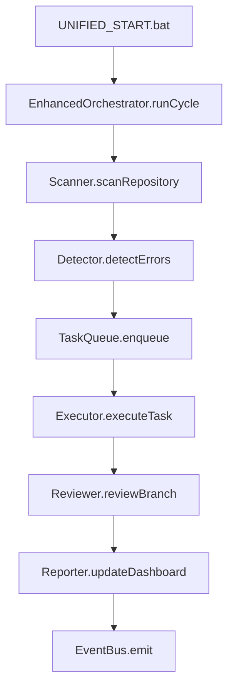
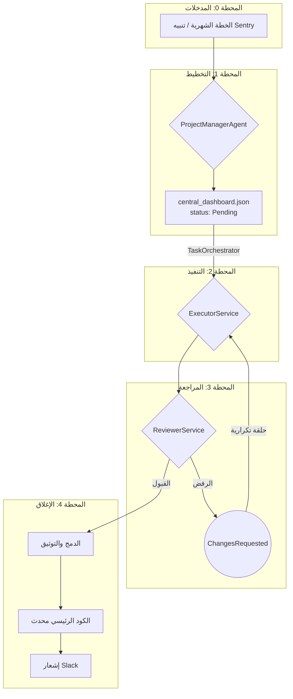

# ⚙️ نظام إدارة المهام والإصلاح الذاتي المحسن (v5.0)
**نظام متكامل مع Enhanced Auto-Fix System - من المشكلة إلى الحل الموثق**

**الإصدار:** 5.0  
**التحديث الأخير:** اليوم
**النظام المحسن:** Enhanced Auto-Fix System + EnhancedOrchestrator  
**التوافق:** Smart Executor v3.0، Enhanced Reviewer v4.0، TypeScript Types  
**الموقع:** `docs/6_fixing/auto-fix-system/`

---

## 1. نظرة عامة على النظام المحسن

نظام إدارة المهام والإصلاح الذاتي المحسن هو نظام متكامل يجمع بين:

- **Enhanced Auto-Fix System**: النظام المحسن للإصلاح التلقائي
- **EnhancedOrchestrator**: منسق ذكي للمهام
- **Type Safety**: أمان الأنواع مع TypeScript
- **EventBus**: نظام أحداث محسن
- **Plugin System**: نظام إضافات قابل للتوسع

### الهدف الأساسي:
إنشاء حلقة مغلقة ذكية تعمل بشكل تلقائي للكشف عن الأخطاء وإصلاحها ومراجعتها وتوثيقها.

## 2. المكونات المحسنة (v5.0)

### النظام المحسن الجديد:
```typescript
// المكونات الرئيسية
import { EnhancedOrchestrator } from './auto-fix-system/enhanced-orchestrator';
import { AutoFixSystem } from './auto-fix-system';
import { TaskRequest, TaskResult } from './auto-fix-system/core/types';

// التشغيل التلقائي
const system = new AutoFixSystem();
await system.start();

// دورة إصلاح واحدة
await system.runCycle();
```

### المكونات الأساسية:
- **`EnhancedOrchestrator`**: منسق ذكي محسن
- **`Scanner`**: ماسح ملفات متقدم
- **`Detector`**: كاشف أخطاء مع AI
- **`TaskQueue`**: طابور مهام ذكي
- **`Executor`**: منفذ محافظ وآمن
- **`Reviewer`**: مراجع متعدد المستويات

### الميزات الجديدة:
- **Type Safety كامل** مع TypeScript
- **EventBus محسن** للتواصل بين المكونات
- **Plugin System** قابل للتوسع
- **Backup & Rollback** ذكي وآمن
- **تقارير مركزية** محسنة

---

## 3. النظام المحسن - دورة ذكية متقدمة

### الدورة الذكية المحسنة:


### الخطوات التفصيلية:
1. **المسح الذكي**: فحص الملفات في apps/ و packages/
2. **الكشف المتقدم**: استخدام AI + Static Analysis
3. **إنشاء المهام**: تحويل الأخطاء إلى TaskRequest
4. **التنفيذ الآمن**: نسخ احتياطية + إصلاح + تحقق
5. **المراجعة الشاملة**: جودة + أمان + اختبارات
6. **التقارير المركزية**: تحديث central_dashboard.json

### الملفات والمواقع الرئيسية:
- `docs/6_fixing/auto-fix-system/` - النظام المحسن
- `docs/6_fixing/reports/central_dashboard.json` - اللوحة المركزية
- `UNIFIED_START.bat` - التشغيل الموحد
- `http://localhost:3000/dashboard` - لوحة التحكم التفاعلية

## 4. دورة الحياة الكاملة (النظام القديم - مرجع)

### المحطة صفر: المدخلات (Inputs)
تبدأ العملية بـ "طلب عمل" من مصدرين:
- **خطة شهرية:** `ProjectManagerAgent` يقرأ `MONTHLY_PLAN.md` لإنشاء مهمة `Feature`.
- **خطأ من Sentry:** `ProjectManagerAgent` يتلقى تنبيهًا لإنشاء مهمة `Fix`.

### المحطة الأولى: التخطيط (Planning)
- **المسؤول:** `ProjectManagerAgent`
- **الإجراء:** يقرأ الطلب وينشئ "تذكرة عمل" مفصلة في `central_dashboard.json` بحالة `Pending`.

```json
{
  "id": "TASK-2024-12-001",
  "title": "إصلاح خطأ تسجيل الدخول",
  "description": "المستخدمون لا يستطيعون تسجيل الدخول",
  "files_to_modify": ["src/auth.js", "src/login.js"],
  "acceptance_criteria": [
    "يجب أن يتمكن المستخدم من تسجيل الدخول",
    "يجب عرض رسالة خطأ واضحة عند الفشل"
  ],
  "priority": "high",
  "status": "Pending",
  "created_at": "2024-12-15T10:00:00Z"
}
```

### المحطة الثانية: التنفيذ (Execution)
- **المسؤول:** `ExecutorService`
- **الخطوات:**
  1.  **استلام المهمة:** `TaskOrchestrator` يسند المهمة ويغير حالتها إلى `InProgress`.
  2.  **بناء السياق:** يستخدم `Gemini Embeddings` للبحث عن حلول مشابهة في قاعدة المعرفة.
  3.  **المراجعة السياقية:** يحلل التبعيات باستخدام `dependency-cruiser` لتجنب التعارضات.
  4.  **التطوير الموجه بالاختبار (TDD):** يكتب اختبارًا فاشلاً أولاً، ثم يستخدم `Gemini Code Assist` لتوليد الكود الذي ينجح الاختبار.
  5.  **التحقق الذاتي:** يشغل `eslint`, `prettier`, `npm test`, `npm audit` للتأكد من الجودة.
  6.  **التوثيق الآلي:** يستخدم Gemini لإنشاء تقرير إصلاح JSON.
  7.  **إنشاء Pull Request:** ينشئ PR تلقائيًا على GitHub ويغير حالة المهمة إلى `AwaitingReview`.

### المحطة الثالثة: المراجعة (Review)
- **المسؤول:** `ReviewerService`
- **الخطوات:**
  1.  **فحص المظهر:** `eslint` و `prettier`.
  2.  **فحص الأمان:** `npm audit` و `CodeQL`.
  3.  **فحص الموثوقية:** `npm test`.
  4.  **فحص الذكاء:** يستخدم Gemini لمراجعة جودة الكود، التزامه بالمعمارية، وتحقيقه للهدف.
- **اتخاذ القرار:**
  - **قبول:** يغير الحالة إلى `Approved`.
  - **رفض:** يغير الحالة إلى `ChangesRequested` مع إضافة ملاحظات.

### المحطة الرابعة: الإغلاق والتوثيق (Closure)
- **المسؤول:** `ReviewerService` (بعد الموافقة)
- **الخطوات:**
  1.  **الدمج الآمن:** يدمج الـ Pull Request في `main` ويحذف الفرع.
  2.  **التوثيق التلقائي:** يحدث `CHANGELOG.md` و `fixes_log.md`.
  3.  **الإغلاق النهائي:** يغير حالة المهمة إلى `Done` ويرسل إشعارًا إلى Slack.

---

## 4. الحلقة التكرارية (Feedback Loop)
في حالة `ChangesRequested`، تحدث الحلقة التالية:
1.  `ReviewerService` يرفض مع ملاحظات.
2.  `TaskOrchestrator` يعيد إسناد المهمة إلى `ExecutorService`.
3.  `ExecutorService` يقرأ الملاحظات، يطبق التحسينات في نفس الفرع، ويعيد التسليم للمراجعة.

---

## 5. الرسم التخطيطي للعملية



هذه هي الآلية الكاملة. هي نظام محكم يضمن أن كل تغيير يمر عبر عملية صارمة من التخطيط، التنفيذ، المراجعة، والتوثيق، وكل ذلك بشكل آلي.