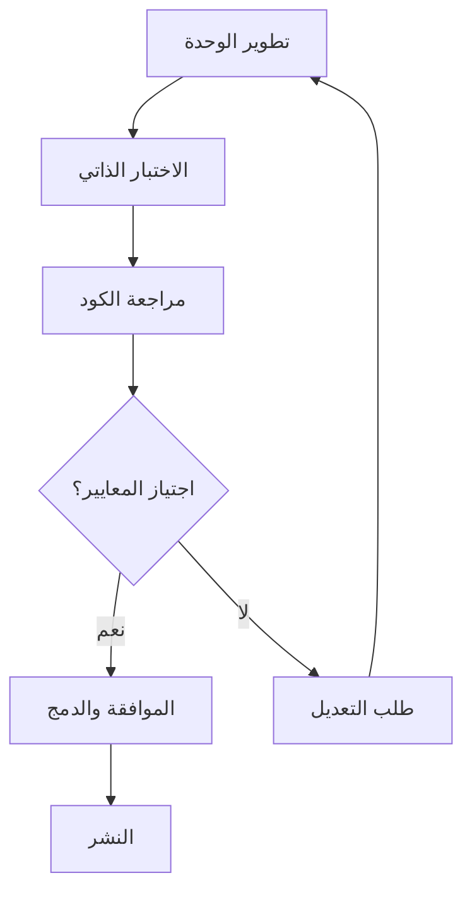

# 📜 دستور المبرمج في مشروع G-Assistant

**_لكل من يساهم في هذا النظام الذكي، بشريًا كان أو صناعيًا._**

---

## 🔒 الفصل الأول: الالتزام بالمسؤولية التقنية

### المبادئ الأساسية:
- **الشفافية في التبعيات**: لا تكتب دالة تعتمد على دوال خفية أو غير موثقة.
- **الحفاظ على النظافة المعمارية**: لا تدخل تغييرات دون مراجعة وحدة التأثير (`impactReview`)، مهما كانت صغيرة.
- **الاحترام للنطاق**: لا تلوث النطاق العالمي بدوال أو متغيرات خارج وحدتك. الالتزام بنمط `Module Pattern` ليس خيارًا، بل مبدأ.

### التطبيق العملي:
```javascript
// ✅ صحيح - وحدة معزولة ومعرفة بوضوح
defineModule('System.MyModule', function(injector) {
  const dependencies = injector.get('System.RequiredModule');
  
  return {
    /**
     * دالة موثقة بوضوح
     * @param {string} input - المدخل المطلوب
     * @returns {Object} النتيجة المعالجة
     */
    processData(input) {
      return dependencies.process(input);
    }
  };
});

// ❌ خطأ - تلويث النطاق العالمي
var globalFunction = function() { /* ... */ };
```

---

## 📚 الفصل الثاني: التوثيق كواجب أخلاقي

### القواعد الذهبية:
- **كل دالة لها قصة، فاكتبها**: باستخدام JSDoc موحد، دون أي اختصارات.
- **الشفرة غير الموثقة = خطأ منطقي في المستقبل.**
- **سمعة الوحدة تعكس توثيقها**: إن غاب التوثيق، فلا جدوى من إعادة الاستخدام.

### معايير التوثيق:
```javascript
/**
 * معالج البيانات المالية المتقدم
 * يقوم بتحليل وتنسيق البيانات المالية مع التحقق من الصحة
 * 
 * @param {Object} financialData - البيانات المالية الخام
 * @param {string} financialData.type - نوع البيانات (income/expense/asset)
 * @param {number} financialData.amount - المبلغ
 * @param {Date} financialData.date - تاريخ العملية
 * @param {Object} options - خيارات المعالجة
 * @param {boolean} options.validate - تفعيل التحقق من الصحة
 * @param {string} options.currency - العملة المطلوبة
 * 
 * @returns {Promise<Object>} البيانات المعالجة والمنسقة
 * @throws {ValidationError} عند فشل التحقق من صحة البيانات
 * @throws {ProcessingError} عند فشل المعالجة
 * 
 * @example
 * const result = await processFinancialData({
 *   type: 'income',
 *   amount: 1000,
 *   date: new Date()
 * }, { validate: true, currency: 'SAR' });
 * 
 * @since 6.0.0
 * @author G-Assistant Team
 */
async function processFinancialData(financialData, options = {}) {
  // تنفيذ الدالة...
}
```

---

## 🧪 الفصل الثالث: الاختبار والتثبت

### المبادئ الأساسية:
- **الاختبار ليس رفاهية، بل أمانة**: كل وحدة تُعاد هيكلتها يجب أن تُختبر بشكل مستقل.
- **تغطية الاختبار جزء من المراجعة، وليست مرحلة لاحقة.**
- **Logger لا يُستخدم للتجميل، بل للكشف عن الحقيقة.**

### معايير الاختبار:
```javascript
// اختبار شامل لكل وحدة
describe('System.FinancialProcessor', () => {
  let processor;
  
  beforeEach(() => {
    processor = GAssistant.Utils.Injector.get('System.FinancialProcessor');
  });
  
  describe('processFinancialData', () => {
    it('should process valid financial data correctly', async () => {
      const input = { type: 'income', amount: 1000, date: new Date() };
      const result = await processor.processFinancialData(input);
      
      expect(result).toBeDefined();
      expect(result.processed).toBe(true);
      expect(result.amount).toBe(1000);
    });
    
    it('should throw ValidationError for invalid data', async () => {
      const input = { type: 'invalid', amount: -100 };
      
      await expect(processor.processFinancialData(input))
        .rejects.toThrow('ValidationError');
    });
    
    it('should handle edge cases gracefully', async () => {
      const input = { type: 'income', amount: 0, date: null };
      const result = await processor.processFinancialData(input);
      
      expect(result.warnings).toContain('Zero amount detected');
    });
  });
});
```

---

## 🧠 الفصل الرابع: التفكير المعماري فوق الإنجاز السريع

### القواعد الذهبية:
- **لا تبني دالة عملاقة مهما كانت عبقريتك، قسمت الدالة قسمت المشكلة.**
- **اعتمادك على أكثر من ثلاث وحدات علامة خطر.**
- **فصل الاهتمامات قاعدة ذهبية، وليس اقتراحًا نظريًا.**

### التطبيق المعماري:
```javascript
// ✅ صحيح - فصل الاهتمامات
defineModule('System.DataProcessor', function(injector) {
  const validator = injector.get('System.DataValidator');
  const formatter = injector.get('System.DataFormatter');
  const logger = injector.get('System.ErrorLogger');
  
  return {
    async processData(data) {
      try {
        // خطوة 1: التحقق
        const validatedData = await validator.validate(data);
        
        // خطوة 2: المعالجة
        const processedData = this.transformData(validatedData);
        
        // خطوة 3: التنسيق
        return formatter.format(processedData);
        
      } catch (error) {
        logger.logError(error, { operation: 'processData', data });
        throw error;
      }
    },
    
    // دالة مساعدة صغيرة ومحددة
    transformData(data) {
      return data.map(item => ({
        ...item,
        processed: true,
        timestamp: new Date().toISOString()
      }));
    }
  };
});

// ❌ خطأ - دالة عملاقة تفعل كل شيء
function processEverything(data) {
  // 200+ سطر من الكود المختلط
  // التحقق + المعالجة + التنسيق + التسجيل + ...
}
```

---

## 🔄 الفصل الخامس: التعاون بين البشر والذكاء الصناعي

### مبادئ التعاون:
- **المبرمج البشري يخطئ، والمبرمج الصناعي قد لا يفهم السياق. كلاكما يكمل الآخر.**
- **شارك المعرفة، لا تُخزنها.**
- **كل وحدة تُراجع بمزيج من الفحص الآلي والتفكير المنطقي.**

### عملية المراجعة المختلطة:
```javascript
/**
 * مراجعة الكود - قائمة التحقق
 * 
 * الفحص الآلي (AI):
 * ✅ التحقق من صحة الصيغة
 * ✅ اكتشاف الأخطاء المنطقية
 * ✅ فحص الأداء والتعقيد
 * ✅ التحقق من معايير الكود
 * 
 * المراجعة البشرية:
 * ✅ فهم السياق والمتطلبات
 * ✅ تقييم التصميم المعماري
 * ✅ مراجعة منطق العمل
 * ✅ التحقق من تجربة المستخدم
 */
```

---

## 📋 الفصل السادس: معايير الجودة والامتثال

### قائمة التحقق الإلزامية:
- [ ] **التوثيق**: كل دالة عامة موثقة بـ JSDoc
- [ ] **الاختبارات**: تغطية لا تقل عن 80%
- [ ] **الأداء**: لا تتجاوز العمليات 2 ثانية
- [ ] **الأمان**: فحص المدخلات والتحقق من الصلاحيات
- [ ] **التوافق**: يعمل مع جميع المتصفحات المدعومة
- [ ] **إدارة الأخطاء**: معالجة شاملة للاستثناءات
- [ ] **التسجيل**: تسجيل العمليات المهمة والأخطاء

### معايير الأداء:
```javascript
// مثال على معايير الأداء المطلوبة
const PERFORMANCE_STANDARDS = {
  MAX_RESPONSE_TIME: 2000, // 2 ثانية
  MAX_MEMORY_USAGE: 50 * 1024 * 1024, // 50 MB
  MIN_TEST_COVERAGE: 80, // 80%
  MAX_CYCLOMATIC_COMPLEXITY: 10,
  MAX_FUNCTION_LENGTH: 50, // 50 سطر
  MAX_MODULE_DEPENDENCIES: 3
};
```

---

## 🏛️ الفصل السابع: الحوكمة والمساءلة

### هيكل المسؤوليات:
- **مطور الوحدة**: مسؤول عن التنفيذ والاختبار والتوثيق
- **مراجع الكود**: مسؤول عن فحص الجودة والامتثال
- **مهندس النظام**: مسؤول عن التكامل والأداء العام
- **مدير الجودة**: مسؤول عن معايير الجودة والامتثال

### عملية الموافقة:


---

## ✨ ختم الدستور

### التوقيع والالتزام:
أي تعديل لا يحترم هذا الدستور هو نقطة تراجع في مشروع هدفه التقدم المنهجي، لا الترقيع اللحظي.

**بتوقيعي على هذا الدستور، أتعهد بـ:**
- الالتزام بجميع المعايير والمبادئ المذكورة
- المساهمة في تطوير وتحسين هذه المعايير
- مراجعة ومساعدة المطورين الآخرين في تطبيق هذه المبادئ
- الإبلاغ عن أي انتهاكات أو مشاكل في الجودة

---

### 📝 نموذج التوقيع

```
التوقيع الرقمي:
الاسم: ________________
التاريخ: ________________
الدور: ________________
التوقيع: ________________

أتعهد بالالتزام بدستور المبرمج في مشروع G-Assistant
والعمل وفقاً لأعلى معايير الجودة والاحترافية.
```

---

**📅 تاريخ الإصدار**: يناير 2025  
**🔄 رقم الإصدار**: 1.0  
**👥 المؤلفون**: فريق G-Assistant  
**📧 للاستفسارات**: راجع ملف CONTRIBUTING.md

---

*هذا الدستور وثيقة حية تتطور مع نمو المشروع وتطور أفضل الممارسات في هندسة البرمجيات.*