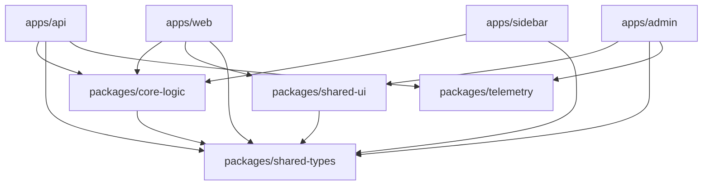

# 🏗️ هيكل مساحة العمل - Monorepo Architecture

> **الهدف:** فهم خريطة المشروع وأين يقع كل جزء لتسهيل التنقل والتطوير

## 📊 نظرة عامة على Monorepo

```
monorepo-new/
├── apps/                    # 🎯 التطبيقات الرئيسية
│   ├── web/                # واجهة الويب (React/Next.js)
│   ├── sidebar/            # الشريط الجانبي (Google Apps Script)
│   ├── api/                # خادم API (NestJS)
│   └── admin/              # بوابة الإدارة (React)
├── packages/               # 📦 الحزم المشتركة
│   ├── core-logic/         # منطق الأعمال الأساسي
│   ├── shared-ui/          # مكونات واجهة المستخدم
│   ├── shared-types/       # تعريفات TypeScript
│   ├── config/             # إعدادات مشتركة (ESLint, Prettier)
│   └── telemetry/          # نظام المراقبة والتسجيل
├── tools/                  # 🛠️ أدوات التطوير
│   ├── scripts/            # سكربتات البناء والنشر
│   └── generators/         # مولدات الكود
├── docs/                   # 📚 التوثيق
└── .turbo/                 # 🚀 Turborepo cache
```

## 🎯 التطبيقات الرئيسية (apps/)

### `apps/web/` - واجهة الويب
```typescript
// المسؤوليات
- واجهة المستخدم الرئيسية
- لوحة التحكم التفاعلية
- إدارة المشاريع والوثائق

// التقنيات المستخدمة
- Next.js 14 (App Router)
- TypeScript
- Tailwind CSS
- Zustand (إدارة الحالة)

// نقطة الدخول
apps/web/src/app/page.tsx
```

### `apps/sidebar/` - الشريط الجانبي
```typescript
// المسؤوليات
- واجهة داخل Google Sheets
- تفاعل مباشر مع Gemini AI
- أدوات مالية ومحاسبية

// التقنيات المستخدمة
- Google Apps Script
- TypeScript
- Vite (للبناء)
- HTML/CSS/JS

// نقطة الدخول
apps/sidebar/src/main.ts
```

### `apps/api/` - خادم API
```typescript
// المسؤوليات
- REST API endpoints
- معالجة طلبات الذكاء الاصطناعي
- إدارة قواعد البيانات
- المصادقة والتخويل

// التقنيات المستخدمة
- NestJS
- TypeScript
- Prisma ORM
- PostgreSQL
- Redis (للتخزين المؤقت)

// نقطة الدخول
apps/api/src/main.ts
```

### `apps/admin/` - بوابة الإدارة
```typescript
// المسؤوليات
- إدارة المستخدمين
- مراقبة النظام
- إعدادات التطبيق
- تحليل الاستخدام

// التقنيات المستخدمة
- React 18
- TypeScript
- Material-UI
- React Query

// نقطة الدخول
apps/admin/src/App.tsx
```

## 📦 الحزم المشتركة (packages/)

### `packages/core-logic/` - منطق الأعمال
```typescript
// الوحدات الرئيسية
├── src/
│   ├── ai/                 # خدمات الذكاء الاصطناعي
│   │   ├── gemini.service.ts
│   │   ├── embeddings.service.ts
│   │   └── rag.pipeline.ts
│   ├── agents/             # الوكلاء المتخصصون
│   │   ├── cfo.agent.ts
│   │   ├── developer.agent.ts
│   │   └── base.agent.ts
│   ├── tools/              # الأدوات المساعدة
│   │   ├── sheets.tool.ts
│   │   ├── code-review.tool.ts
│   │   └── financial.tool.ts
│   └── utils/              # المرافق العامة
│       ├── validation.ts
│       ├── encryption.ts
│       └── date.helpers.ts

// الاستخدام
import { GeminiService } from '@g-assistant/core-logic/ai';
import { CFOAgent } from '@g-assistant/core-logic/agents';
```

### `packages/shared-ui/` - مكونات واجهة المستخدم
```typescript
// المكونات المشتركة
├── src/
│   ├── components/         # المكونات الأساسية
│   │   ├── Button/
│   │   ├── Input/
│   │   ├── Modal/
│   │   └── DataTable/
│   ├── layouts/            # تخطيطات الصفحات
│   │   ├── DashboardLayout/
│   │   └── AuthLayout/
│   ├── hooks/              # React Hooks مخصصة
│   │   ├── useAuth.ts
│   │   ├── useApi.ts
│   │   └── useLocalStorage.ts
│   └── styles/             # الأنماط المشتركة
│       ├── globals.css
│       └── themes.ts

// الاستخدام
import { Button, Modal } from '@g-assistant/shared-ui';
import { useAuth } from '@g-assistant/shared-ui/hooks';
```

### `packages/shared-types/` - تعريفات TypeScript
```typescript
// الأنواع المشتركة
├── src/
│   ├── api/                # أنواع API
│   │   ├── requests.ts
│   │   ├── responses.ts
│   │   └── errors.ts
│   ├── entities/           # كيانات قاعدة البيانات
│   │   ├── user.types.ts
│   │   ├── project.types.ts
│   │   └── task.types.ts
│   ├── ai/                 # أنواع الذكاء الاصطناعي
│   │   ├── gemini.types.ts
│   │   └── agent.types.ts
│   └── common/             # الأنواع العامة
│       ├── pagination.ts
│       └── filters.ts

// الاستخدام
import type { User, Project } from '@g-assistant/shared-types';
import type { GeminiRequest } from '@g-assistant/shared-types/ai';
```

## 🔗 تحليل تبعيات الحزم

### عرض الخريطة البصرية
```bash
# إنشاء خريطة التبعيات
npx turbo graph

# التركيز على حزمة معينة
npx turbo graph --focus=core-logic

# حفظ الخريطة كصورة
npx turbo graph --output=dependency-graph.svg
```

### مثال على خريطة التبعيات


## ➕ إضافة تطبيق أو حزمة جديدة

### إضافة تطبيق جديد
```bash
# استخدام مولد Turborepo
pnpm dlx turbo generate workspace --name=mobile --type=app

# أو يدوياً
mkdir apps/mobile
cd apps/mobile

# إنشاء package.json
cat > package.json << EOF
{
  "name": "@g-assistant/mobile",
  "version": "0.1.0",
  "private": true,
  "scripts": {
    "dev": "expo start",
    "build": "expo build",
    "test": "jest"
  },
  "dependencies": {
    "@g-assistant/core-logic": "workspace:*",
    "@g-assistant/shared-types": "workspace:*"
  }
}
EOF
```

### إضافة حزمة جديدة
```bash
# إنشاء حزمة جديدة
mkdir packages/notifications
cd packages/notifications

# إعداد package.json
cat > package.json << EOF
{
  "name": "@g-assistant/notifications",
  "version": "0.1.0",
  "main": "./dist/index.js",
  "types": "./dist/index.d.ts",
  "exports": {
    ".": {
      "types": "./dist/index.d.ts",
      "default": "./dist/index.js"
    }
  },
  "scripts": {
    "build": "tsup src/index.ts --format cjs,esm --dts",
    "dev": "tsup src/index.ts --format cjs,esm --dts --watch",
    "test": "jest"
  },
  "dependencies": {
    "@g-assistant/shared-types": "workspace:*"
  }
}
EOF
```

### تحديث إعدادات TypeScript
```json
// tsconfig.json (في الجذر)
{
  "compilerOptions": {
    "paths": {
      "@g-assistant/core-logic": ["./packages/core-logic/src"],
      "@g-assistant/shared-ui": ["./packages/shared-ui/src"],
      "@g-assistant/shared-types": ["./packages/shared-types/src"],
      "@g-assistant/notifications": ["./packages/notifications/src"]
    }
  }
}
```

## 🚀 أوامر Turborepo المفيدة

### البناء والتطوير
```bash
# بناء جميع التطبيقات والحزم
pnpm turbo build

# تشغيل وضع التطوير لجميع التطبيقات
pnpm turbo dev

# بناء تطبيق محدد فقط
pnpm turbo build --filter=web

# بناء مع التبعيات
pnpm turbo build --filter=web...
```

### الاختبار والفحص
```bash
# تشغيل جميع الاختبارات
pnpm turbo test

# فحص الكود
pnpm turbo lint

# إصلاح مشاكل ESLint
pnpm turbo lint --fix

# فحص الأنواع
pnpm turbo type-check
```

### إدارة التبعيات
```bash
# إضافة تبعية لتطبيق محدد
pnpm add lodash --filter=web

# إضافة تبعية تطوير لجميع المساحات
pnpm add -D typescript --filter="*"

# تحديث جميع التبعيات
pnpm update --recursive
```

## 📁 اصطلاحات التسمية

### الملفات والمجلدات
```bash
# المجلدات: kebab-case
user-management/
api-gateway/

# الملفات: kebab-case.extension
user.service.ts
api.controller.ts
user-profile.component.tsx

# الملفات الخاصة: PascalCase
README.md
CHANGELOG.md
```

### الحزم والتطبيقات
```json
// التطبيقات
"@g-assistant/web"
"@g-assistant/api"
"@g-assistant/sidebar"

// الحزم
"@g-assistant/core-logic"
"@g-assistant/shared-ui"
"@g-assistant/shared-types"
```

## 🔧 إعدادات مساحة العمل

### turbo.json
```json
{
  "$schema": "https://turbo.build/schema.json",
  "pipeline": {
    "build": {
      "dependsOn": ["^build"],
      "outputs": ["dist/**", ".next/**"]
    },
    "dev": {
      "cache": false,
      "persistent": true
    },
    "test": {
      "dependsOn": ["build"],
      "outputs": ["coverage/**"]
    },
    "lint": {
      "outputs": []
    }
  }
}
```

### pnpm-workspace.yaml
```yaml
packages:
  - 'apps/*'
  - 'packages/*'
  - 'tools/*'
```

## 🎯 أفضل الممارسات

### تنظيم الكود
1. **فصل الاهتمامات:** كل حزمة لها غرض واحد واضح
2. **إعادة الاستخدام:** الكود المشترك في packages/
3. **التبعيات الواضحة:** استخدم workspace: للحزم المحلية
4. **التوثيق:** كل حزمة لها README.md خاص بها

### الأداء
1. **التخزين المؤقت:** استفد من Turbo cache
2. **البناء التدريجي:** بناء ما تغير فقط
3. **التوازي:** تشغيل المهام بالتوازي عند الإمكان

### الصيانة
1. **التحديث المنتظم:** حدث التبعيات بانتظام
2. **المراقبة:** راقب حجم الحزم وأداء البناء
3. **التنظيف:** احذف الكود غير المستخدم