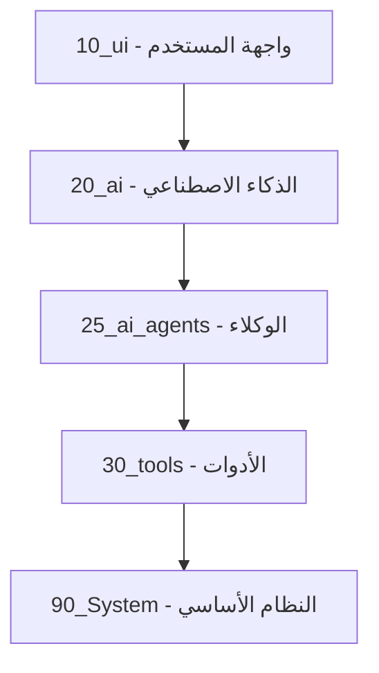
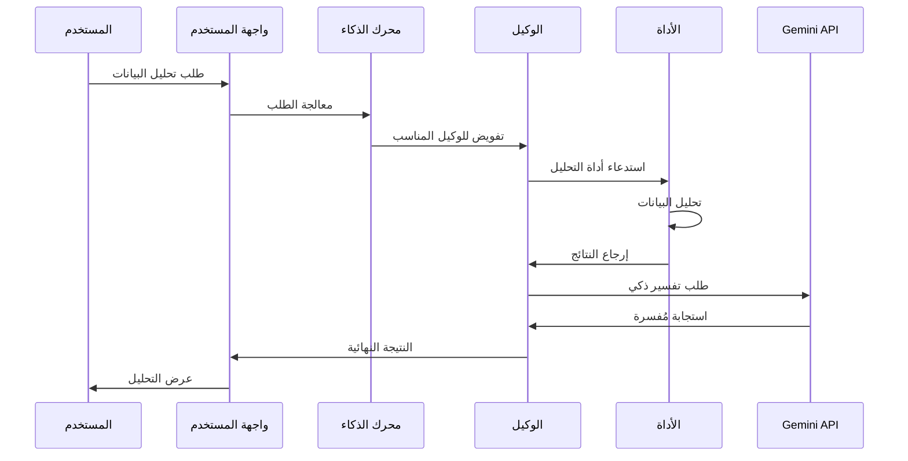

# 🏗️ البنية المعمارية - AzizSys

## نظرة عامة

AzizSys مبني على معمارية معيارية متقدمة تضمن الفصل بين المسؤوليات وسهولة الصيانة.

## 🎯 المبادئ الأساسية

### 1. الفصل بين الطبقات


### 2. نظام حقن التبعيات
```javascript
// مثال على تعريف وحدة
defineModule('System.Tools.SheetsAnalyzer', ({ Utils, Config }) => {
  return {
    analyzeSheet(sheetName) {
      // منطق التحليل
    }
  };
});

// استخدام الوحدة
const analyzer = Injector.get('Tools', 'SheetsAnalyzer');
```

## 🔄 تدفق البيانات

### السيناريو النموذجي


## 🧩 المكونات الرئيسية

### 1. النواة الأساسية (Core)
```
core/
├── 00_bootstrap.js     # نقطة البداية
├── 01_utils.js        # الأدوات المساعدة
├── 02_config.js       # إدارة الإعدادات
└── 03_injector.js     # نظام حقن التبعيات
```

### 2. وحدات الذكاء الاصطناعي
```
modules/ai/
├── orchestrator.js    # منسق الطلبات
├── gemini-adapter.js  # محول Gemini API
├── memory.js          # إدارة الذاكرة
└── embeddings.js      # نظام التضمين
```

### 3. الوكلاء المتخصصون
```
modules/agents/
├── cfo-agent.js       # المحلل المالي
├── dev-agent.js       # مساعد المطور
└── data-agent.js      # مدير البيانات
```

## 🔍 نظام التضمين (Embeddings)

### البنية


### التنفيذ
```javascript
// إنشاء تضمين
const embedding = await embeddingService.generateEmbedding(text);

// البحث الدلالي
const results = await embeddingService.searchSimilar(query, {
  limit: 5,
  threshold: 0.7
});
```

## 🔐 طبقة الأمان

### التحقق من الصحة
```javascript
// تنظيف المدخلات
function sanitizeInput(input) {
  return input
    .replace(/[<>]/g, '')
    .replace(/['"]/g, '')
    .substring(0, 1000);
}

// التحقق من الصلاحيات
function checkPermissions(user, action) {
  return user.permissions.includes(action);
}
```

## 📊 مراقبة الأداء

### المقاييس الأساسية
- زمن الاستجابة للطلبات
- معدل نجاح العمليات
- استخدام الذاكرة
- عدد استدعاءات API

### التنبيهات
```javascript
// مراقبة الأخطاء
function monitorErrors(error) {
  if (error.severity === 'critical') {
    sendAlert(error);
  }
  logError(error);
}
```

## 🚀 استراتيجية التوسع

### إضافة وكيل جديد
1. إنشاء ملف الوكيل في `modules/agents/`
2. تسجيل الوكيل في الكتالوج
3. تحديث التوثيق
4. إضافة الاختبارات

### إضافة أداة جديدة
1. إنشاء ملف الأداة في `modules/tools/`
2. تنفيذ الواجهة المطلوبة
3. تسجيل في كتالوج الأدوات
4. اختبار التكامل

## 🔧 أفضل الممارسات

### 1. تسمية الوحدات
```javascript
// صحيح
defineModule('System.Tools.DataAnalyzer', ...);

// خطأ
defineModule('analyzer', ...);
```

### 2. معالجة الأخطاء
```javascript
// استخدام try-catch دائماً
try {
  const result = await processData(data);
  return { success: true, data: result };
} catch (error) {
  Logger.error('خطأ في معالجة البيانات:', error);
  return { success: false, error: error.message };
}
```

### 3. التوثيق
```javascript
/**
 * تحليل البيانات في الجدول
 * @param {string} sheetName - اسم الجدول
 * @param {Object} options - خيارات التحليل
 * @returns {Promise<Object>} نتائج التحليل
 */
async function analyzeSheet(sheetName, options = {}) {
  // التنفيذ
}
```

## 📈 خارطة الطريق

### المرحلة الحالية (v6.4)
- ✅ نظام التضمين المتقدم
- ✅ واجهة السايدبار v3
- ✅ تكامل WhatsApp

### المرحلة القادمة (v6.5)
- 🔄 تحسين الأداء
- 🔄 واجهة إدارة متقدمة
- 🔄 دعم اللغات المتعددة

### المستقبل (v7.0)
- 📋 تكامل BigQuery
- 📋 نظام التقارير المتقدم
- 📋 API خارجي كامل