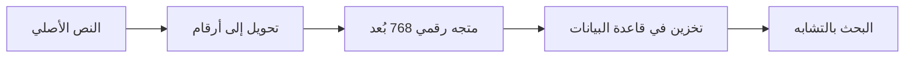

# 🔍 دليل نظام التضمين (Embeddings) - AzizSys

## نظرة عامة

نظام التضمين في AzizSys يوفر قدرات بحث دلالي متقدمة، مما يمكّن النظام من فهم المعنى وليس فقط مطابقة الكلمات.

## 🧠 كيف يعمل النظام

### المفهوم الأساسي


### مثال عملي
```javascript
// النص الأصلي
const text = "كيف أحسب الربح الصافي للشركة؟";

// التحويل إلى تضمين
const embedding = await embeddingService.generateEmbedding(text);
// النتيجة: [0.123, -0.456, 0.789, ...] (768 رقم)

// البحث عن نصوص مشابهة
const similar = await embeddingService.searchSimilar(
  "حساب الأرباح المالية", 
  { threshold: 0.7 }
);
```

## 🏗️ بنية النظام

### المكونات الرئيسية

#### 1. خدمة التضمين (EmbeddingService)
```javascript
// modules/services/embedding-service.js
defineModule('System.Services.EmbeddingService', ({ Utils, Config }) => {
  
  class EmbeddingService {
    constructor() {
      this.cache = new Map();
      this.vectorStore = new VectorStore();
    }
    
    async generateEmbedding(text, metadata = {}) {
      // تنظيف النص
      const cleanText = this.preprocessText(text);
      
      // التحقق من الذاكرة المؤقتة
      const cached = this.cache.get(cleanText);
      if (cached) return cached;
      
      // استدعاء Gemini API
      const embedding = await this.callGeminiEmbedding(cleanText);
      
      // حفظ النتيجة
      const result = {
        id: Utils.generateId(),
        text: cleanText,
        embedding: embedding,
        metadata: metadata,
        timestamp: new Date()
      };
      
      this.cache.set(cleanText, result);
      await this.vectorStore.save(result);
      
      return result;
    }
    
    async searchSimilar(query, options = {}) {
      const queryEmbedding = await this.generateEmbedding(query);
      
      return await this.vectorStore.findSimilar(
        queryEmbedding.embedding,
        {
          limit: options.limit || 10,
          threshold: options.threshold || 0.6
        }
      );
    }
  }
  
  return new EmbeddingService();
});
```

#### 2. مخزن المتجهات (VectorStore)
```javascript
// modules/storage/vector-store.js
defineModule('System.Storage.VectorStore', ({ Utils }) => {
  
  class VectorStore {
    constructor() {
      this.sheetName = 'VectorStore_Cache';
      this.initializeSheet();
    }
    
    initializeSheet() {
      this.sheet = Utils.getSheet(this.sheetName, [
        'ID', 'Text', 'Embedding', 'Metadata', 'Timestamp', 'Hash'
      ]);
    }
    
    async save(embeddingData) {
      const row = [
        embeddingData.id,
        embeddingData.text,
        JSON.stringify(embeddingData.embedding),
        JSON.stringify(embeddingData.metadata),
        embeddingData.timestamp,
        this.generateHash(embeddingData.text)
      ];
      
      this.sheet.appendRow(row);
    }
    
    async findSimilar(queryVector, options) {
      const data = this.loadAllEmbeddings();
      const similarities = [];
      
      for (const item of data) {
        const similarity = this.calculateCosineSimilarity(
          queryVector, 
          item.embedding
        );
        
        if (similarity >= options.threshold) {
          similarities.push({
            ...item,
            similarity: similarity
          });
        }
      }
      
      return similarities
        .sort((a, b) => b.similarity - a.similarity)
        .slice(0, options.limit);
    }
    
    calculateCosineSimilarity(vectorA, vectorB) {
      let dotProduct = 0;
      let normA = 0;
      let normB = 0;
      
      for (let i = 0; i < vectorA.length; i++) {
        dotProduct += vectorA[i] * vectorB[i];
        normA += vectorA[i] * vectorA[i];
        normB += vectorB[i] * vectorB[i];
      }
      
      return dotProduct / (Math.sqrt(normA) * Math.sqrt(normB));
    }
  }
  
  return VectorStore;
});
```

## 🚀 الاستخدام العملي

### 1. فهرسة المحادثات
```javascript
// تلقائياً عند كل رسالة
async function indexMessage(userMessage, assistantResponse) {
  const embeddingService = Injector.get('Services', 'EmbeddingService');
  
  // فهرسة رسالة المستخدم
  await embeddingService.generateEmbedding(userMessage, {
    type: 'user_message',
    timestamp: new Date(),
    context: 'chat'
  });
  
  // فهرسة رد المساعد
  await embeddingService.generateEmbedding(assistantResponse, {
    type: 'assistant_response',
    timestamp: new Date(),
    context: 'chat'
  });
}
```

### 2. البحث في المحادثات السابقة
```javascript
// في واجهة السايدبار
async function searchPreviousChats(query) {
  const embeddingService = Injector.get('Services', 'EmbeddingService');
  
  const results = await embeddingService.searchSimilar(query, {
    limit: 5,
    threshold: 0.7
  });
  
  return results.map(result => ({
    text: result.text,
    similarity: Math.round(result.similarity * 100),
    date: result.metadata.timestamp
  }));
}
```

### 3. تحسين إجابات الوكلاء
```javascript
// في الوكيل المالي
async function enhanceFinancialResponse(userQuery) {
  const embeddingService = Injector.get('Services', 'EmbeddingService');
  
  // البحث عن استفسارات مشابهة
  const similarQueries = await embeddingService.searchSimilar(userQuery, {
    limit: 3,
    threshold: 0.8
  });
  
  // استخدام السياق في الإجابة
  const context = similarQueries.map(q => q.text).join('\n');
  
  const response = await AI.generateContent({
    prompt: `
    السؤال الحالي: ${userQuery}
    
    أسئلة مشابهة سابقة:
    ${context}
    
    قدم إجابة شاملة مع الاستفادة من السياق السابق.
    `
  });
  
  return response;
}
```

## 🔧 التكوين والتحسين

### إعدادات الأداء
```javascript
// config/embeddings-config.js
const EMBEDDINGS_CONFIG = {
  // حجم الدفعة للمعالجة
  BATCH_SIZE: 50,
  
  // الحد الأقصى لطول النص
  MAX_TEXT_LENGTH: 8000,
  
  // عتبة التشابه للبحث
  SIMILARITY_THRESHOLD: 0.6,
  
  // عتبة اكتشاف التكرار
  DUPLICATE_THRESHOLD: 0.95,
  
  // مدة التخزين المؤقت (بالثواني)
  CACHE_TTL: 3600,
  
  // حجم الذاكرة المؤقتة
  CACHE_SIZE: 1000
};
```

### تحسين الأداء
```javascript
// تحسين معالجة النصوص
class TextPreprocessor {
  static preprocess(text) {
    return text
      .trim()
      .replace(/\s+/g, ' ')           // توحيد المسافات
      .replace(/[^\w\s\u0600-\u06FF]/g, '') // إزالة الرموز الخاصة
      .substring(0, EMBEDDINGS_CONFIG.MAX_TEXT_LENGTH);
  }
  
  static shouldIndex(text) {
    // تجاهل النصوص القصيرة جداً
    if (text.length < 10) return false;
    
    // تجاهل النصوص المتكررة
    if (this.isCommonPhrase(text)) return false;
    
    return true;
  }
  
  static isCommonPhrase(text) {
    const commonPhrases = [
      'شكراً', 'مرحباً', 'وداعاً', 'نعم', 'لا'
    ];
    
    return commonPhrases.includes(text.toLowerCase());
  }
}
```

## 📊 مراقبة ومتابعة النظام

### إحصائيات الاستخدام
```javascript
// dashboard/embeddings-stats.js
function getEmbeddingsStats() {
  const embeddingService = Injector.get('Services', 'EmbeddingService');
  
  return {
    totalEmbeddings: embeddingService.getTotalCount(),
    cacheHitRate: embeddingService.getCacheHitRate(),
    averageSearchTime: embeddingService.getAverageSearchTime(),
    storageUsage: embeddingService.getStorageUsage(),
    lastIndexed: embeddingService.getLastIndexedTime()
  };
}
```

### تنظيف البيانات
```javascript
// maintenance/cleanup-embeddings.js
async function cleanupOldEmbeddings() {
  const embeddingService = Injector.get('Services', 'EmbeddingService');
  
  // حذف التضمينات القديمة (أكثر من 6 أشهر)
  const sixMonthsAgo = new Date();
  sixMonthsAgo.setMonth(sixMonthsAgo.getMonth() - 6);
  
  const deleted = await embeddingService.deleteOlderThan(sixMonthsAgo);
  
  Utils.log(`تم حذف ${deleted} تضمين قديم`);
  
  // إزالة التكرارات
  const duplicates = await embeddingService.findDuplicates(0.95);
  await embeddingService.removeDuplicates(duplicates);
  
  Utils.log(`تم حذف ${duplicates.length} تضمين مكرر`);
}
```

## 🎯 حالات الاستخدام المتقدمة

### 1. التصنيف التلقائي
```javascript
// تصنيف الاستفسارات تلقائياً
async function classifyQuery(query) {
  const categories = [
    { name: 'مالي', examples: ['الربح', 'الخسارة', 'الميزانية'] },
    { name: 'تقني', examples: ['كود', 'برمجة', 'خطأ'] },
    { name: 'عام', examples: ['مساعدة', 'شرح', 'كيف'] }
  ];
  
  let bestMatch = { category: 'عام', score: 0 };
  
  for (const category of categories) {
    for (const example of category.examples) {
      const similarity = await calculateSimilarity(query, example);
      if (similarity > bestMatch.score) {
        bestMatch = { category: category.name, score: similarity };
      }
    }
  }
  
  return bestMatch;
}
```

### 2. اقتراح المحتوى
```javascript
// اقتراح محتوى ذي صلة
async function suggestRelatedContent(currentTopic) {
  const embeddingService = Injector.get('Services', 'EmbeddingService');
  
  const related = await embeddingService.searchSimilar(currentTopic, {
    limit: 5,
    threshold: 0.6
  });
  
  return related.map(item => ({
    title: item.text.substring(0, 50) + '...',
    relevance: Math.round(item.similarity * 100),
    type: item.metadata.type
  }));
}
```

### 3. تحليل المشاعر السياقي
```javascript
// تحليل المشاعر باستخدام السياق
async function analyzeSentimentWithContext(message) {
  const embeddingService = Injector.get('Services', 'EmbeddingService');
  
  // البحث عن رسائل مشابهة
  const similar = await embeddingService.searchSimilar(message, {
    limit: 3,
    threshold: 0.7
  });
  
  // تحليل المشاعر مع السياق
  const context = similar.map(s => s.text).join('\n');
  
  const analysis = await AI.generateContent({
    prompt: `
    حلل مشاعر هذه الرسالة مع مراعاة السياق:
    
    الرسالة: ${message}
    
    السياق المشابه:
    ${context}
    
    أعط تقييماً من 1-10 للمشاعر (1=سلبي جداً، 10=إيجابي جداً)
    `
  });
  
  return analysis;
}
```

## 🔍 استكشاف الأخطاء

### مشاكل شائعة وحلولها

#### 1. بطء في البحث
```javascript
// تحسين الفهرسة
async function optimizeSearch() {
  // إنشاء فهرس للبيانات المتكررة
  const frequentQueries = await getFrequentQueries();
  
  for (const query of frequentQueries) {
    await embeddingService.precomputeEmbedding(query);
  }
}
```

#### 2. نتائج غير دقيقة
```javascript
// ضبط عتبة التشابه
function adjustSimilarityThreshold(query, results) {
  // إذا كانت النتائج قليلة، قلل العتبة
  if (results.length < 3) {
    return Math.max(0.4, currentThreshold - 0.1);
  }
  
  // إذا كانت النتائج كثيرة وغير دقيقة، ارفع العتبة
  if (results.length > 10) {
    return Math.min(0.9, currentThreshold + 0.1);
  }
  
  return currentThreshold;
}
```

#### 3. استهلاك ذاكرة عالي
```javascript
// تنظيف الذاكرة المؤقتة
function cleanupCache() {
  const embeddingService = Injector.get('Services', 'EmbeddingService');
  
  // حذف العناصر القديمة من الذاكرة المؤقتة
  embeddingService.cache.clear();
  
  // إعادة تحميل العناصر الأكثر استخداماً فقط
  const frequent = embeddingService.getMostFrequentQueries(100);
  frequent.forEach(query => {
    embeddingService.preloadToCache(query);
  });
}
```

## 📚 مراجع إضافية

- [Gemini Embeddings API](https://ai.google.dev/docs/embeddings_guide)
- [Vector Similarity Search](https://en.wikipedia.org/wiki/Cosine_similarity)
- [دليل تحسين الأداء](performance-optimization.md)
- [أمثلة متقدمة](advanced-examples.md)