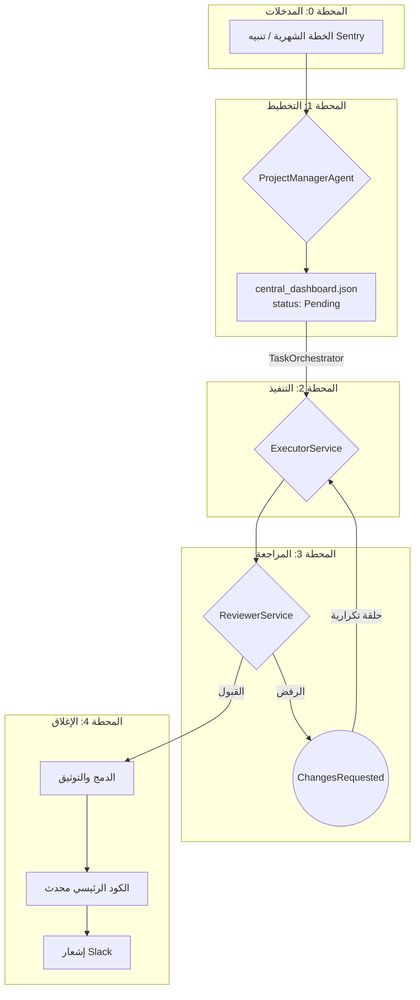

# ⚙️ خطة الإصلاح الذاتي المتكاملة (v4.0) - النظام المحدث
**من المشكلة إلى الحل الموثق - مع النظام التلقائي الجديد**

**الإصدار:** 4.0  
**التحديث الأخير:** 8 يناير 2025
**النظام الجديد:** AutoRepairSuite + مدير النظام التلقائي  
**التوافق:** بروتوكول المنفذ v5.0، بروتوكول المراجع v3.0، استراتيجية تكامل Gemini v2.0

---

## 1. نظرة عامة

خطة الإصلاح الذاتي هي نظام حلقة مغلقة (Closed-Loop) يعمل بشكل آلي لإصلاح الأخطاء وتطوير الميزات الجديدة بدون تدخل بشري، مدعوم بـ Google Gemini AI.

## 2. المكونات الجديدة (v4.0)

### النظام التلقائي الجديد:
- **`AutoSystemManager` (مدير النظام التلقائي):** يعمل كل 5 دقائق ويدير جميع العمليات
- **`AutoRepairSuite` (مجموعة الإصلاح الذكي):** يستخدم Gemini AI للإصلاح التلقائي
- **`NxProjectMonitor` (مراقب مشروع Nx):** يراقب حالة التطبيقات والمكتبات
- **`DetailedAnalyzer` (محلل مفصل):** يحلل الأخطاء بدقة ويحدد مواقعها

### المكونات الأساسية (محدثة):
- **`TaskOrchestrator` (منسق المهام):** محدث ليعمل مع Nx
- **`AICodeFixer` (مصحح الكود الذكي):** يستخدم Gemini لإصلاح الأخطاء
- **`AutoTester` (مختبر تلقائي):** يختبر الإصلاحات تلقائياً

---

## 3. النظام الجديد - دورة تلقائية كل 5 دقائق

### العملية التلقائية الجديدة:
1. **AutoSystemManager** يبدأ دورة جديدة كل 5 دقائق
2. **NxProjectMonitor** يفحص حالة التطبيقات والمكتبات
3. **AutoRepairSuite** يكتشف الأخطاء ويصلحها بـ Gemini AI
4. **TaskOrchestrator** يحدث اللوحة المركزية
5. **تسجيل العمليات** في auto_system_log.json

### الملفات الرئيسية:
- `auto-system-manager.js` - المدير الرئيسي
- `nx_central_dashboard.json` - اللوحة المركزية
- `QUICK_START.bat` - تشغيل سريع
- لوحة التحكم HTML - http://localhost:3000

## 4. دورة الحياة الكاملة (النظام القديم - مرجع)

### المحطة صفر: المدخلات (Inputs)
تبدأ العملية بـ "طلب عمل" من مصدرين:
- **خطة شهرية:** `ProjectManagerAgent` يقرأ `MONTHLY_PLAN.md` لإنشاء مهمة `Feature`.
- **خطأ من Sentry:** `ProjectManagerAgent` يتلقى تنبيهًا لإنشاء مهمة `Fix`.

### المحطة الأولى: التخطيط (Planning)
- **المسؤول:** `ProjectManagerAgent`
- **الإجراء:** يقرأ الطلب وينشئ "تذكرة عمل" مفصلة في `central_dashboard.json` بحالة `Pending`.

```json
{
  "id": "TASK-2024-12-001",
  "title": "إصلاح خطأ تسجيل الدخول",
  "description": "المستخدمون لا يستطيعون تسجيل الدخول",
  "files_to_modify": ["src/auth.js", "src/login.js"],
  "acceptance_criteria": [
    "يجب أن يتمكن المستخدم من تسجيل الدخول",
    "يجب عرض رسالة خطأ واضحة عند الفشل"
  ],
  "priority": "high",
  "status": "Pending",
  "created_at": "2024-12-15T10:00:00Z"
}
```

### المحطة الثانية: التنفيذ (Execution)
- **المسؤول:** `ExecutorService`
- **الخطوات:**
  1.  **استلام المهمة:** `TaskOrchestrator` يسند المهمة ويغير حالتها إلى `InProgress`.
  2.  **بناء السياق:** يستخدم `Gemini Embeddings` للبحث عن حلول مشابهة في قاعدة المعرفة.
  3.  **المراجعة السياقية:** يحلل التبعيات باستخدام `dependency-cruiser` لتجنب التعارضات.
  4.  **التطوير الموجه بالاختبار (TDD):** يكتب اختبارًا فاشلاً أولاً، ثم يستخدم `Gemini Code Assist` لتوليد الكود الذي ينجح الاختبار.
  5.  **التحقق الذاتي:** يشغل `eslint`, `prettier`, `npm test`, `npm audit` للتأكد من الجودة.
  6.  **التوثيق الآلي:** يستخدم Gemini لإنشاء تقرير إصلاح JSON.
  7.  **إنشاء Pull Request:** ينشئ PR تلقائيًا على GitHub ويغير حالة المهمة إلى `AwaitingReview`.

### المحطة الثالثة: المراجعة (Review)
- **المسؤول:** `ReviewerService`
- **الخطوات:**
  1.  **فحص المظهر:** `eslint` و `prettier`.
  2.  **فحص الأمان:** `npm audit` و `CodeQL`.
  3.  **فحص الموثوقية:** `npm test`.
  4.  **فحص الذكاء:** يستخدم Gemini لمراجعة جودة الكود، التزامه بالمعمارية، وتحقيقه للهدف.
- **اتخاذ القرار:**
  - **قبول:** يغير الحالة إلى `Approved`.
  - **رفض:** يغير الحالة إلى `ChangesRequested` مع إضافة ملاحظات.

### المحطة الرابعة: الإغلاق والتوثيق (Closure)
- **المسؤول:** `ReviewerService` (بعد الموافقة)
- **الخطوات:**
  1.  **الدمج الآمن:** يدمج الـ Pull Request في `main` ويحذف الفرع.
  2.  **التوثيق التلقائي:** يحدث `CHANGELOG.md` و `fixes_log.md`.
  3.  **الإغلاق النهائي:** يغير حالة المهمة إلى `Done` ويرسل إشعارًا إلى Slack.

---

## 4. الحلقة التكرارية (Feedback Loop)
في حالة `ChangesRequested`، تحدث الحلقة التالية:
1.  `ReviewerService` يرفض مع ملاحظات.
2.  `TaskOrchestrator` يعيد إسناد المهمة إلى `ExecutorService`.
3.  `ExecutorService` يقرأ الملاحظات، يطبق التحسينات في نفس الفرع، ويعيد التسليم للمراجعة.

---

## 5. الرسم التخطيطي للعملية



هذه هي الآلية الكاملة. هي نظام محكم يضمن أن كل تغيير يمر عبر عملية صارمة من التخطيط، التنفيذ، المراجعة، والتوثيق، وكل ذلك بشكل آلي.