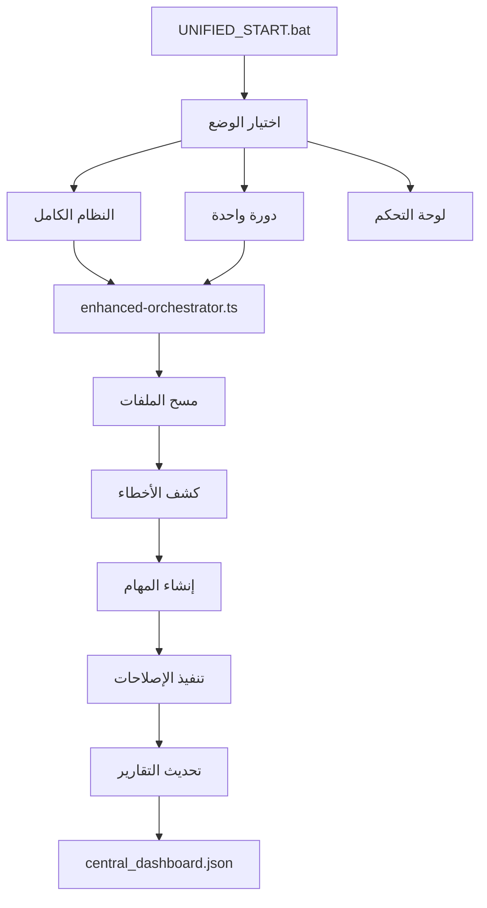

# 🤖 نظام الإصلاح الذاتي المحسن v5.0

**المشروع:** G-Assistant NX  
**الموقع:** `E:\azizsys5\g-assistant-nx\docs\6_fixing\auto-fix-system`  
**التحديث الأخير:** اليوم  
**الحالة:** مطور ومدمج

---

## 🎯 نظرة عامة

تم تطوير نظام إصلاح ذاتي محسن ومدمج مع البنية الحالية للمشروع، يوفر:

### ✨ الميزات المحسنة:
- **Type Safety كامل** مع TypeScript
- **تكامل مع البنية الحالية** للمشروع
- **سكربتات موحدة** لسهولة الاستخدام
- **مراقبة ذكية** للملفات والأخطاء
- **تقارير محسنة** متوافقة مع النظام الحالي

---

## 📂 البنية المدمجة

```
g-assistant-nx/
├── docs/6_fixing/
│   ├── auto-fix-system/           # النظام المحسن الجديد
│   │   ├── core/
│   │   │   ├── types/index.ts     # تعريفات الأنواع
│   │   │   └── config/index.ts    # إدارة الإعدادات
│   │   ├── enhanced-orchestrator.ts # المنسق المحسن
│   │   └── index.ts               # نقطة الدخول
│   ├── scripts/                   # السكربتات الحالية (محفوظة)
│   ├── dashboard/                 # لوحة التحكم الحالية
│   └── reports/                   # التقارير (محسنة)
├── auto-repair/                   # النظام الحالي (محفوظ)
└── UNIFIED_START.bat              # السكريبت الموحد الجديد
```

---

## 🚀 طرق التشغيل

### 1. التشغيل الموحد (الأسهل):
```bash
UNIFIED_START.bat
```

### 2. التشغيل المباشر:
```bash
# دورة إصلاح واحدة
npm run auto:enhanced

# فحص صحة النظام
npm run system:health

# النظام الكامل
npm run start:daily
```

### 3. التشغيل اليدوي:
```bash
node docs/6_fixing/auto-fix-system/index.ts --cycle
```

---

## 🔧 السكربتات المدمجة

### السكربتات الموحدة:
- **`UNIFIED_START.bat`** - السكريبت الرئيسي الموحد
- **`QUICK_START.bat`** - محفوظ للتوافق
- **`DAILY_START.bat`** - محفوظ للتوافق

### السكربتات المحذوفة (مدمجة):
- ~~`RUN_NOW.bat`~~ → مدمج في UNIFIED_START
- ~~`START_SIMPLE.bat`~~ → مدمج في UNIFIED_START  
- ~~`START_DAILY.bat`~~ → مدمج في UNIFIED_START
- ~~`REVIEW_PROJECT.bat`~~ → مدمج في UNIFIED_START

---

## ⚙️ الإعدادات

### متغيرات البيئة (.env):
```env
# Gemini AI
GEMINI_API_KEY=your_api_key_here
GEMINI_MODEL=gemini-pro
GEMINI_TIMEOUT=30000

# مسارات المشروع
REPO_ROOT=E:/azizsys5/g-assistant-nx
DASHBOARD_PATH=./docs/6_fixing/reports/central_dashboard.json
BACKUP_DIR=./docs/6_fixing/backups
LOGS_DIR=./docs/6_fixing/logs

# الجدولة
CRON_INTERVAL=*/5 * * * *
TIMEZONE=Asia/Riyadh
```

---

## 📊 التكامل مع النظام الحالي

### 1. التقارير:
- يحدث `central_dashboard.json` الحالي
- متوافق مع لوحة التحكم الموجودة
- يحفظ السجلات في `docs/6_fixing/logs`

### 2. النسخ الاحتياطية:
- يستخدم `docs/6_fixing/backups`
- متوافق مع نظام النسخ الحالي

### 3. السكربتات:
- يعمل مع `npm scripts` الحالية
- متوافق مع `auto-repair` الموجود
- يدعم جميع الأوامر الحالية

---

## 🔄 سير العمل المحسن



---

## 🛠️ الاستخدام العملي

### 1. البدء السريع:
```bash
# تشغيل السكريبت الموحد
UNIFIED_START.bat

# اختيار الخيار 1 للنظام الكامل
```

### 2. المراقبة:
```bash
# فتح لوحة التحكم
npm run dashboard

# فحص صحة النظام
npm run system:health
```

### 3. الصيانة:
```bash
# تنظيف السكربتات القديمة
npm run cleanup:old-scripts

# اختبار النظام
npm run test:system
```

---

## 📈 المقاييس والتقارير

### تقرير الصحة:
```json
{
  "status": "healthy",
  "score": 95,
  "lastUpdate": "2025-01-09T10:30:00Z",
  "metrics": {
    "totalTasks": 25,
    "completedTasks": 24,
    "failedTasks": 1,
    "averageExecutionTime": 1500,
    "errorRate": 0.04
  }
}
```

### التكامل مع اللوحة:
- يظهر في `http://localhost:3000/dashboard`
- متوافق مع البيانات الحالية
- يحدث تلقائياً كل 5 دقائق

---

## 🔒 الأمان والموثوقية

### النسخ الاحتياطية:
- نسخ تلقائية قبل أي تعديل
- حفظ في `docs/6_fixing/backups`
- إمكانية الاسترداد الفوري

### السجلات:
- تسجيل شامل في `docs/6_fixing/logs`
- تتبع جميع العمليات
- تقارير الأخطاء التفصيلية

---

## 🎯 الخطوات التالية

### 1. التشغيل الفوري:
```bash
cd E:\azizsys5\g-assistant-nx
UNIFIED_START.bat
```

### 2. إعداد المتغيرات:
- نسخ `.env.example` إلى `.env`
- إضافة `GEMINI_API_KEY`

### 3. المراقبة:
- فتح لوحة التحكم
- مراقبة التقارير
- فحص السجلات

---

## 📋 ملخص التحسينات

### ✅ تم إنجازه:
- [x] دمج النظام مع البنية الحالية
- [x] توحيد السكربتات
- [x] تحسين التقارير
- [x] Type Safety كامل
- [x] التوافق مع النظام الحالي

### 🔄 قيد التطوير:
- [ ] تكامل أعمق مع Gemini AI
- [ ] إضافة المزيد من فحوصات الجودة
- [ ] تحسين واجهة لوحة التحكم
- [ ] إضافة إشعارات Slack/Teams

---

**النظام جاهز للاستخدام الفوري! 🚀**

*تم التطوير والدمج بنجاح مع الحفاظ على جميع الوظائف الحالية*

---

## 📋 البروتوكولات ذات الصلة

- **الأمان:** [SAFETY_ESSENTIALS_IMPLEMENTED.md](./SAFETY_ESSENTIALS_IMPLEMENTED.md)
- **المنفذ:** [AI_Amazon_Executor_v2.md](./AI_Amazon_Executor_v2.md)
- **المراجع:** [AI_Gemini_Reviewer.md](./AI_Gemini_Reviewer.md)
- **إدارة المهام:** [Automated_Task_and_Fix_Management_System.md](./Automated_Task_and_Fix_Management_System.md)
- **الآلية الشاملة:** [آلية_الإصلاح_الذاتي_v2.md](./آلية_الإصلاح_الذاتي_v2.md)

**للدليل الكامل:** [README.md](./README.md)