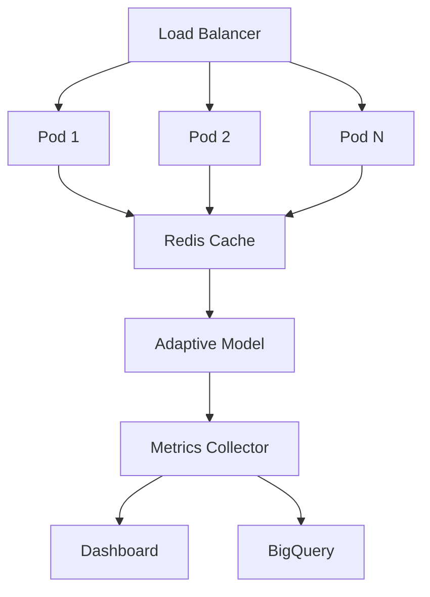

# 🚀 المرحلة الثالثة - النظام التكيفي والتوسع المتقدم

## 🎯 نظرة عامة

المرحلة الثالثة من خطة أكتوبر تركز على تطوير النظام التكيفي الذكي مع التوسع الأفقي والمراقبة المتقدمة. هذه المرحلة تمثل الانتقال من النظام الأساسي إلى نظام ذكي قادر على التعلم والتكيف.

## 🧩 المكونات الأساسية

### 1. النظام التكيفي (Adaptive System)
- **النموذج التكيفي**: معالجة ذكية حسب نوع البيانات
- **Feature Flags**: تحكم ديناميكي في الميزات
- **Fallback Mechanism**: نظام بديل عند الأخطاء

### 2. البنية التحتية المتقدمة
- **Kubernetes Orchestration**: نشر وإدارة الحاويات
- **Auto-scaling**: توسع تلقائي حسب الحمل
- **Load Balancing**: توزيع الأحمال الذكي

### 3. نظام المراقبة والتحليلات
- **Real-time Metrics**: مؤشرات في الوقت الفعلي
- **Interactive Dashboard**: لوحة تحكم تفاعلية
- **Performance Analytics**: تحليلات الأداء المتقدمة

## 📋 دليل التشغيل السريع

### التثبيت والإعداد
```bash
# تثبيت المكتبات
npm install

# إعداد النظام التكيفي
npm run setup

# تشغيل الاختبارات
npm test

# تشغيل لوحة المراقبة
npm run dashboard
```

### النشر على Kubernetes
```bash
# نشر النظام
npm run deploy

# مراقبة الحالة
kubectl get pods -l app=azizsys

# عرض السجلات
kubectl logs -f deployment/azizsys-adaptive
```

## 🧪 الاختبارات والقياسات

### اختبار النموذج التكيفي
```bash
node test_adaptive_model.js
```

### مؤشرات الأداء المستهدفة
| المؤشر | الهدف | الوصف |
|--------|-------|--------|
| AI Latency | < 300ms | زمن استجابة الذكاء الاصطناعي |
| Cache Hit Rate | ≥ 85% | نسبة استرجاع من الكاش |
| Adaptive Success | ≥ 92% | نجاح النموذج التكيفي |
| Fallback Usage | < 8% | استخدام النموذج الثابت |

## 📊 لوحة المراقبة

### الوصول للوحة التحكم
- **URL**: http://localhost:8080
- **WebSocket**: ws://localhost:8081
- **API**: http://localhost:8080/api/metrics

### الميزات المتاحة
- 📈 رسوم بيانية في الوقت الفعلي
- 🎯 مؤشرات الأداء الحية
- ⚠️ تنبيهات النظام
- 📊 تحليلات مفصلة

## 🔧 التكوين والإعدادات

### Feature Flags
```json
{
  "adaptive_model_enabled": true,
  "learning_mode": "ADAPTIVE",
  "percent_enabled": 20,
  "fallback_enabled": true,
  "metrics_collection": true,
  "real_time_monitoring": true
}
```

### متغيرات البيئة
```env
LEARNING_MODE=ADAPTIVE
REDIS_HOST=redis-service
METRICS_ENABLED=true
FEATURE_FLAGS_ENABLED=true
BIGQUERY_DATASET=azizsys_metrics
```

## 🏗️ البنية المعمارية



## 🚨 استكشاف الأخطاء

### مشاكل شائعة وحلولها

#### النموذج التكيفي لا يعمل
```bash
# فحص Feature Flags
cat config/feature_flags.json

# فحص السجلات
kubectl logs deployment/azizsys-adaptive
```

#### بطء في الاستجابة
```bash
# فحص استخدام الموارد
kubectl top pods

# فحص الكاش
redis-cli info memory
```

#### مشاكل في لوحة المراقبة
```bash
# فحص WebSocket
netstat -an | grep 8081

# إعادة تشغيل لوحة المراقبة
npm run dashboard
```

## 📈 خطة التطوير

### الأسبوع الأول
- [x] إعداد النظام التكيفي
- [x] تكوين Feature Flags
- [x] إنشاء النموذج التكيفي
- [x] إعداد Kubernetes

### الأسبوع الثاني
- [ ] تطوير لوحة المراقبة
- [ ] تكامل مع BigQuery
- [ ] اختبارات الأداء
- [ ] تحسين الخوارزميات

### الأسبوع الثالث
- [ ] اختبارات التحميل
- [ ] تحسين الأداء
- [ ] توثيق شامل
- [ ] تدريب الفريق

### الأسبوع الرابع
- [ ] النشر الإنتاجي
- [ ] مراقبة مستمرة
- [ ] تقرير النجاح
- [ ] التحضير للمرحلة الرابعة

## 🤝 المساهمة

### إرشادات التطوير
1. اتبع معايير الكود المحددة
2. اكتب اختبارات شاملة
3. وثق جميع التغييرات
4. اختبر على بيئة التطوير أولاً

### تقديم التحسينات
1. Fork المشروع
2. إنشاء فرع للميزة
3. Commit التغييرات
4. Push وإنشاء Pull Request

## 📞 الدعم

- 📧 **البريد الإلكتروني**: dev@azizsys.com
- 💬 **Slack**: #azizsys-week3
- 📖 **الوثائق**: [docs.azizsys.com](https://docs.azizsys.com)
- 🐛 **تقارير الأخطاء**: [GitHub Issues](https://github.com/azizsys/issues)

---

**🎯 الهدف**: تحقيق نظام تكيفي ذكي بأداء عالي ومراقبة شاملة

**📅 الموعد المستهدف**: نهاية الأسبوع الثالث من أكتوبر

**✅ الحالة**: قيد التطوير النشط