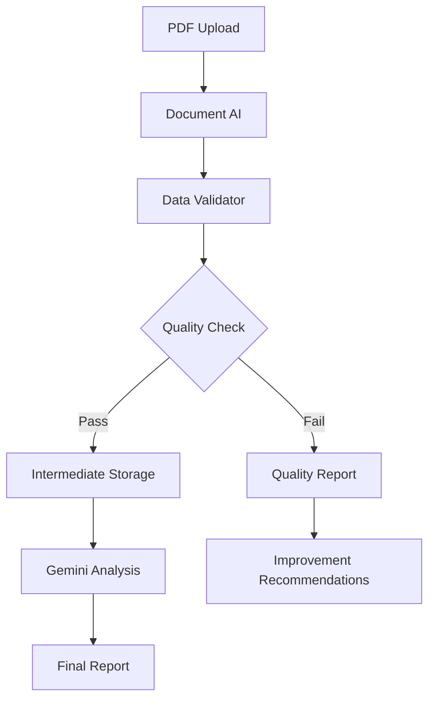
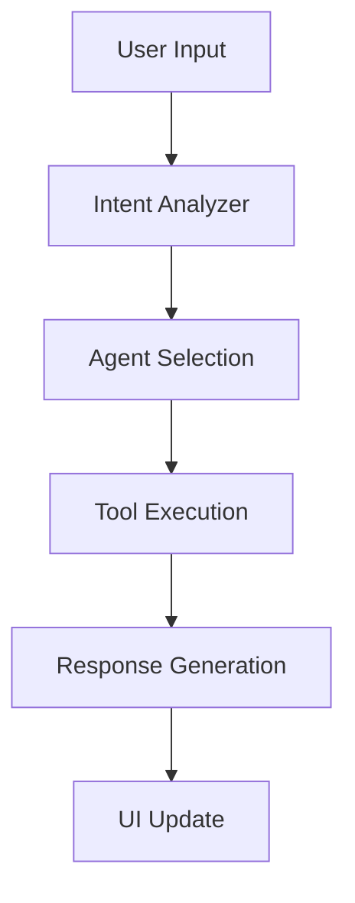

# G-Assistant System Architecture

## 📋 تعريف الوثيقة
**الغرض**: توثيق شامل للتصميم المعماري لنظام G-Assistant، يوضح كيفية تكامل الوحدات والوكلاء ضمن نهج معماري قابل للتوسع والتعديل الذاتي  
**الجمهور المستهدف**: المهندسون المعماريون، المطورون المتقدمون، وفرق التطوير  
**نوع الوثيقة**: وثيقة تقنية أساسية - مستوى متقدم  
**التحديث**: يتم تحديثها مع كل تغيير معماري رئيسي

---

**Version**: 3.0.0  
**Status**: 🚀 Production Ready  
**Last Updated**: ${new Date().toISOString()}

---

## 🏗️ System Overview

G-Assistant is a **modular AI-powered assistant** built on Google Apps Script, designed for enterprise-grade document processing and intelligent automation within Google Sheets environment.

### Core Principles
- **Modular Architecture**: Dependency injection-based module system
- **Hybrid AI Processing**: Document AI + Gemini integration
- **Quality-First**: Built-in data validation and monitoring
- **Scalable Design**: Cloud-native with BigQuery storage

---

## 📊 Architecture Layers

```
┌─────────────────────────────────────────────────────────────┐
│                    PRESENTATION LAYER                       │
├─────────────────────────────────────────────────────────────┤
│  Sidebar.html  │  Sidebar.css  │  Sidebar.js (Enhanced)    │
│  - Accessibility Support  │  - MutationObserver           │
│  - Keyboard Navigation    │  - User Settings              │
└─────────────────────────────────────────────────────────────┘
                                │
┌─────────────────────────────────────────────────────────────┐
│                    ORCHESTRATION LAYER                      │
├─────────────────────────────────────────────────────────────┤
│  System.AI.Orchestrator.Enhanced  │  System.PipelineOrchestrator │
│  - Intent Analysis            │  - Multi-stage Processing   │
│  - Agent Routing             │  - Error Handling           │
└─────────────────────────────────────────────────────────────┘
                                │
┌─────────────────────────────────────────────────────────────┐
│                      AGENT LAYER                            │
├─────────────────────────────────────────────────────────────┤
│  CFO Agent  │  Developer  │  DatabaseManager  │  General   │
│  - Financial Analysis    │  - Code Review                  │
│  - Report Generation     │  - Data Management              │
└─────────────────────────────────────────────────────────────┘
                                │
┌─────────────────────────────────────────────────────────────┐
│                    PROCESSING LAYER                         │
├─────────────────────────────────────────────────────────────┤
│  System.HybridPDFProcessor  │  System.DataValidator        │
│  - Document AI Integration  │  - Quality Control           │
│  - Gemini Analysis          │  - Data Validation           │
└─────────────────────────────────────────────────────────────┘
                                │
┌─────────────────────────────────────────────────────────────┐
│                     SERVICE LAYER                           │
├─────────────────────────────────────────────────────────────┤
│  Services.DocumentAI  │  Services.EnhancedVertexAI        │
│  - Table Extraction   │  - Adapter Tuning                 │
│  - Entity Recognition │  - JSON Schema Output             │
└─────────────────────────────────────────────────────────────┘
                                │
┌─────────────────────────────────────────────────────────────┐
│                     STORAGE LAYER                           │
├─────────────────────────────────────────────────────────────┤
│  Services.IntermediateStorage  │  System.UserSettingsManager │
│  - BigQuery Integration       │  - PropertiesService         │
│  - Fallback Storage          │  - User Preferences          │
└─────────────────────────────────────────────────────────────┘
```

---

## 🔄 Data Flow Architecture

### 1. Document Processing Pipeline



### 2. Agent Orchestration Flow



---

## 🧩 Module Dependencies

### Core System Modules
```
System.Utils.Injector (Root)
├── System.Auth
├── System.Config.Enhanced
├── System.Testing
└── System.Setup
```

### AI Processing Modules
```
System.AI.Orchestrator.Enhanced
├── System.IntentAnalyzer
├── System.AI.Agents.*
├── System.ToolExecutor
└── System.HybridPDFProcessor
    ├── Services.DocumentAI
    ├── Services.EnhancedVertexAI
    └── System.DataValidator
```

### UI and Storage Modules
```
System.UI.Manager
├── System.UI.Controller
├── System.UserSettingsManager
└── Services.IntermediateStorage
```

---

## 🔧 Key Components

### 1. Dependency Injection System
```javascript
// Module Definition
defineModule('ModuleName', function(injector) {
  return {
    // Module implementation
  };
});

// Module Usage
const module = GAssistant.Utils.Injector.get('ModuleName');
```

### 2. Hybrid Processing Pipeline
```javascript
// Document AI → Data Validation → Gemini Analysis
const pipeline = await orchestrator.executeDocumentPipeline(fileId, {
  analysisType: 'financial',
  qualityThreshold: 70
});
```

### 3. Quality Control System
```javascript
// Built-in data validation
const validation = dataValidator.validateExtractedData(data);
if (!validation.isValid) {
  // Handle quality issues
}
```

---

## 🛡️ Security Architecture

### Authentication & Authorization
- **Service Account**: Google Cloud authentication
- **OAuth Scopes**: Minimal required permissions
- **Token Management**: Secure token handling

### Data Protection
- **Input Validation**: All user inputs validated
- **Output Sanitization**: Responses sanitized
- **Access Control**: Role-based permissions

### Privacy Compliance
- **Data Minimization**: Only necessary data processed
- **Retention Policies**: Automatic cleanup of old data
- **Audit Logging**: All operations logged

---

## 📈 Performance Architecture

### Optimization Strategies
- **Lazy Loading**: Modules loaded on demand
- **Caching**: Intermediate results cached
- **Batch Processing**: Multiple operations batched
- **Async Operations**: Non-blocking processing

### Monitoring & Metrics
- **Performance Tracking**: Response times monitored
- **Error Rates**: Failure rates tracked
- **Usage Analytics**: User interaction patterns
- **Resource Utilization**: Memory and CPU usage

---

## 🔄 Scalability Design

### Horizontal Scaling
- **Stateless Design**: No server-side state
- **Load Distribution**: Work distributed across requests
- **Resource Pooling**: Shared resources optimized

### Vertical Scaling
- **Memory Management**: Efficient memory usage
- **Processing Optimization**: CPU-intensive tasks optimized
- **Storage Efficiency**: Data storage optimized

---

## 🧪 Testing Architecture

### Test Pyramid
```
┌─────────────────┐
│  Integration    │  ← pipeline.test.gs
├─────────────────┤
│  Unit Tests     │  ← toolExecutor.test.gs
├─────────────────┤
│  System Tests   │  ← integrationTests.gs
└─────────────────┘
```

### Quality Assurance
- **Automated Testing**: Continuous test execution
- **Code Coverage**: High test coverage maintained
- **Performance Testing**: Load and stress testing
- **Security Testing**: Vulnerability assessments

---

## 🚀 Deployment Architecture

### Environment Management
- **Development**: Local testing environment
- **Staging**: Pre-production validation
- **Production**: Live system deployment

### CI/CD Pipeline
```
Code → Build → Test → Deploy → Monitor
  ↓      ↓       ↓       ↓        ↓
 Git   npm    Tests   clasp   Logging
```

### Release Management
- **Version Control**: Semantic versioning
- **Feature Flags**: Gradual feature rollout
- **Rollback Strategy**: Quick rollback capability
- **Health Checks**: System health monitoring

---

## 📊 Data Architecture

### Storage Strategy
- **Primary**: BigQuery for structured data
- **Fallback**: PropertiesService for reliability
- **Cache**: In-memory for performance
- **Archive**: Long-term data retention

### Data Models
```javascript
// Document Processing Record
{
  document_id: "string",
  extraction_timestamp: "timestamp",
  tables_data: "json",
  entities_data: "json",
  raw_text: "string",
  metadata: "json",
  processing_status: "string"
}
```

---

## 🔮 Future Architecture Considerations

### Planned Enhancements
- **Microservices**: Service decomposition
- **Event-Driven**: Async event processing
- **Multi-Cloud**: Cloud provider diversity
- **Edge Computing**: Distributed processing

### Technology Evolution
- **AI Models**: Latest model integration
- **Performance**: Continuous optimization
- **Security**: Enhanced protection
- **Compliance**: Regulatory adherence

---

## 📋 Architecture Decisions

### Key Design Choices
1. **Apps Script Platform**: Google ecosystem integration
2. **Modular Design**: Maintainability and testability
3. **Hybrid AI**: Best-of-breed AI services
4. **Quality-First**: Built-in validation and monitoring

### Trade-offs Considered
- **Performance vs. Reliability**: Chose reliability
- **Complexity vs. Flexibility**: Chose flexibility
- **Cost vs. Features**: Balanced approach
- **Security vs. Usability**: Security prioritized

---

*This architecture document is maintained automatically and reflects the current system design as of the last update.*